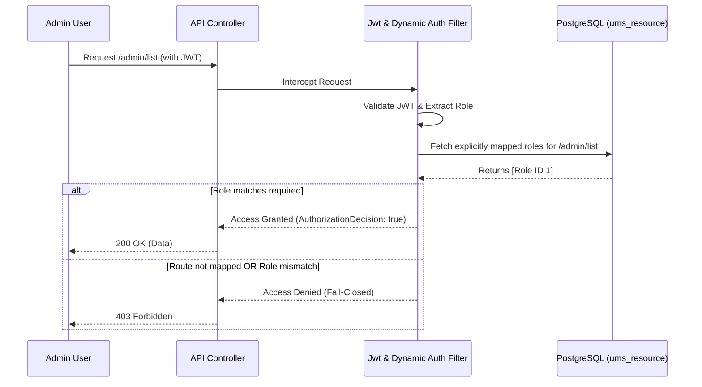
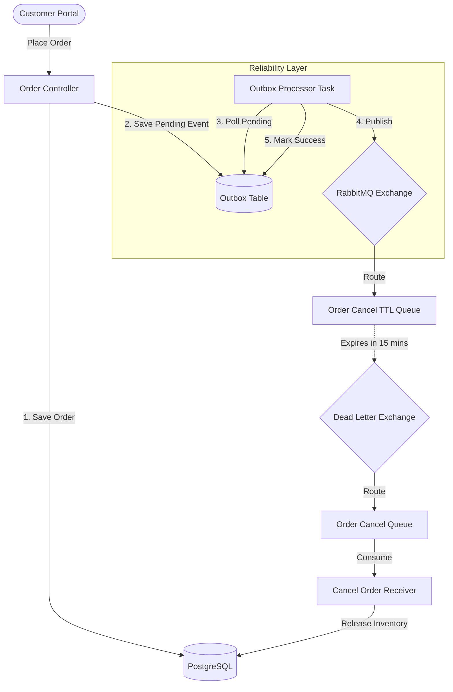
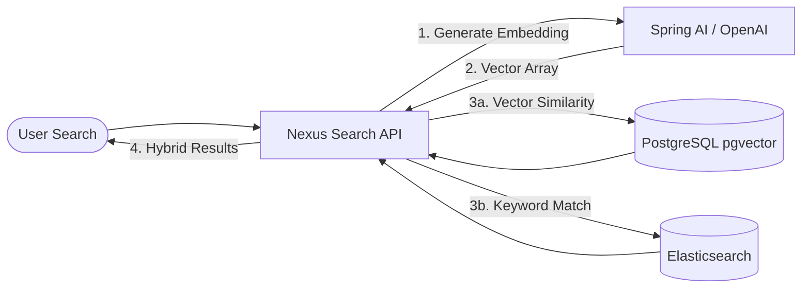
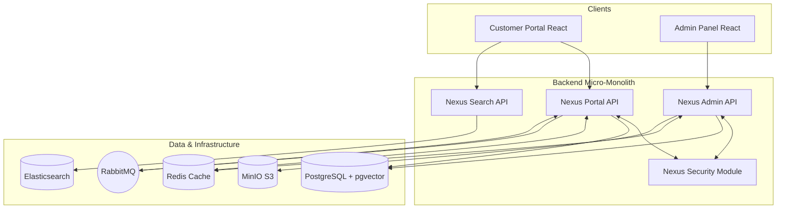

# NexusEngine

NexusEngine is a modern, enterprise-grade e-commerce microservices and monolith hybrid platform designed as a scalable foundation for retail applications. 

## 🏗 System Design & Architecture

NexusEngine is structured as a robust Spring Boot application with a React-based customer portal and admin panel. Below are the detailed architectures for its core components.

### 1. Dynamic Fail-Closed Security (RBAC)
Every request to the Admin API is intercepted by a strict, fail-closed dynamic authorization manager that cross-references the user's JWT with the database's `ums_resource` access control list in real-time.



### 2. Reliable Async Order Processing (Outbox Pattern & Dead-Letter Queues)
To ensure zero data loss during checkout, the system uses the Outbox Pattern. Orders and events are saved in the same database transaction. A background processor reliably publishes these events to RabbitMQ. Unpaid orders expire via a Dead-Letter Queue (DLQ).



### 3. AI-Powered Semantic Search
Products are indexed in Elasticsearch for keyword searches, but they are also converted into 1536-dimensional vector embeddings via OpenAI and stored in PostgreSQL (`pgvector`) for deep semantic similarity searches.



### 4. Overall System Architecture
The high-level macro architecture of the NexusEngine ecosystem.



### Backend Stack
- **Framework**: Java 21, Spring Boot 3.x, Spring Data JPA
- **Security**: Spring Security 6 with strict fail-closed dynamic RBAC
- **Database**: PostgreSQL with pgvector for AI semantic search capabilities
- **Cache & Message Broker**: Redis (Lua-scripted Rate Limiting), RabbitMQ (Async Dead-Letter Queues)
- **Search Engine**: Elasticsearch
- **Object Storage**: MinIO (S3-compatible)
- **AI Integration**: Spring AI (OpenAI)
- **Resilience**: Resilience4j (Circuit Breaker, Rate Limiter)

### Frontend Stack
- **Customer Portal**: React 19, TypeScript, Vite, Redux Toolkit
- **Admin Panel**: React 19, TypeScript, Vite, MUI v6, Recharts

### DevOps & Observability
- **Containerization**: Docker & Docker Compose
- **Monitoring**: Prometheus, Grafana, Spring Boot Actuator
- **CI/CD**: Ready for GitHub Actions / GitLab CI

## 🚀 Getting Started

### Prerequisites
- Docker and Docker Compose
- Node.js >= 20
- Java 21 (if running outside Docker)
- Maven 3.9+

### Running with Docker Compose
The easiest way to start the entire stack (infrastructure + applications) is using Docker Compose.

```bash
# Start infrastructure and application services
docker-compose up -d
```

Services will be available at:
- **Customer Portal (Frontend)**: http://localhost:5174
- **Admin Panel**: http://localhost:5173
- **Backend API**: http://localhost:8080
- **Backend API Swagger UI**: http://localhost:8080/swagger-ui.html
- **Search API**: http://localhost:8081
- **Search API Swagger UI**: http://localhost:8081/swagger-ui.html
- **Grafana (Monitoring)**: http://localhost:3000 (admin/admin)
- **MinIO Console**: http://localhost:9001 (minioadmin/minioadmin)

### Local Development

**1. Start Infrastructure**
```bash
docker-compose up -d postgres redis mongodb rabbitmq elasticsearch minio
```

**2. Start Backend APIs**
```bash
cd NexusCore
./mvnw clean install -DskipTests
java -jar nexus-application/target/nexus-application.jar
java -jar nexus-search/target/nexus-search.jar
```

**3. Start Frontend Portal**
```bash
cd NexusFrontendWeb
npm install
npm run dev
```

**4. Start Admin Panel**
```bash
cd NexusAdminPanel
npm install
npm run dev
```

## 🔐 Key Features
- **Enterprise Security**: Complete JWT-based authentication, hardened against timing attacks, IP spoofing, and excessive permutations. Strict fail-closed dynamic resource routing for Admins.
- **Microservice Resiliency**: Outbox pattern for RabbitMQ message reliability, and circuit breakers via Resilience4j to prevent cascading failures.
- **Rich E-Commerce Flows**: Product browsing, shopping cart, dynamic order expiration, and seamless checkout.
- **Payment Integration**: Razorpay & Stripe integration with webhook verification.
- **Intelligent Recommendations**: Vector embeddings and semantic search powered by pgvector.

## 📈 Monitoring
NexusEngine includes a fully configured observability stack out-of-the-box. Metrics from the Spring Boot application are scraped by Prometheus and visualized in Grafana.

---
*NexusEngine is a portfolio project demonstrating scalable system design, modern full-stack development practices, and enterprise-grade security.*

## 💳 Razorpay Test Cards

When checking out in the Customer Portal with the Razorpay test environment, you can use the following test cards to simulate successful domestic payments:

**Visa (Domestic)**
- Card Number: `4100 2800 0000 1007`
- Expiry: Any future date (e.g., `12/26`)
- CVV: Any 3 digits (e.g., `123`)

**RuPay (Domestic)**
- Card Number: `6527 6589 0000 1005`
- Expiry: Any future date (e.g., `12/26`)
- CVV: Any 3 digits (e.g., `123`)

**Mastercard (Domestic)**
- Card Number: `5555 5555 0008 1006`
- Expiry: Any future date (e.g., `12/26`)
- CVV: Any 3 digits (e.g., `123`)

*(Note: During the 3D Secure OTP verification step, you can enter any random 6-digit OTP like `123456` or simply click "Success").*
