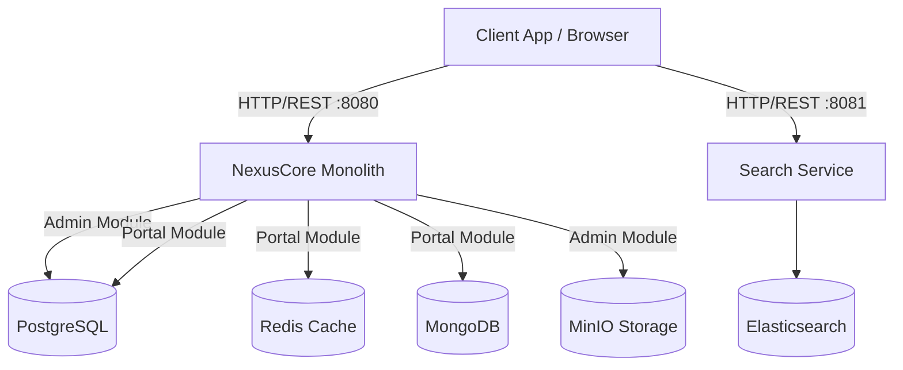
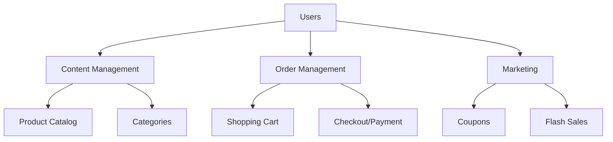

# NexusEngine 🚀

[](https://github.com/AadarshPandey/NexusEngine/actions/workflows/ci.yml)
[](https://github.com/AadarshPandey/NexusEngine/actions/workflows/deploy.yml)


A high-performance, modular monolithic e-commerce engine built with **Spring Boot 3.5**, **JDK 21**, **React 19**, and **PostgreSQL**. Designed for enterprise scale with full Docker containerization and AWS readiness.

## Quick Tips

> 1. **Branch Overview**: The `master` branch is based on Spring Boot 3.5+ + JDK 21.
> 2. **API Documentation**: All modules include Swagger/SpringDoc API docs accessible at `/swagger-ui.html`.

## Preface

The `NexusCore` project aims to create a full-fledged e-commerce backend system built with a modern technology stack.

## Project Overview

`NexusCore` is an e-commerce backend comprising a front-end store API and a back-end management API. Built on Spring Boot + Spring Data JPA + PostgreSQL, it supports Docker containerization deployment.

* **Back-end Management API (`mall-admin`)**: Product management, order management, member management, promotions, operations, content management, statistics reporting, financial management, authority management, and system settings.
* **Customer-Facing Store API (`mall-portal`)**: Home portal, product recommendations, product search, shopping cart, order process, member center, AI chatbot, Razorpay payments.
* **Product Search API (`mall-search`)**: Full-text product search powered by Elasticsearch with real-time sync via RabbitMQ.
* **Customer Storefront (`NexusFrontendWeb`)**: Modern React 19 UI for customers to browse products, view details, and checkout.
* **Admin Dashboard (`NexusAdminPanel`)**: Modern React 19 UI for administrators to manage the store.

### Module Structure
```
NexusCore
├── mall-common      -- Utility classes and common code
├── mall-data-jpa    -- JPA entities, MongoDB documents, and Data repositories
├── mall-security    -- Shared Spring Security wrapper module
├── mall-ai          -- Shared Spring AI library (common chatbot infrastructure)
├── mall-admin       -- Back-end store management API with admin AI assistant
├── mall-search      -- Product search system powered by Elasticsearch
├── mall-portal      -- Front-end store system API with customer AI chatbot
└── mall-application -- Unified monolithic backend application entry point
NexusFrontendWeb
└── Customer Storefront -- React 19 SPA for customers, interacting with mall-portal APIs

NexusAdminPanel
└── Admin Dashboard     -- React 19 SPA for administrators, interacting with mall-admin APIs
```

### Tech Stack

#### Back-end Technologies
| Technology | Description | Official Site |
| --- | --- | --- |
| Spring Boot 3.5 | Web application development framework | https://spring.io/projects/spring-boot |
| Spring Security | Authentication and authorization framework | https://spring.io/projects/spring-security |
| Spring Data JPA | ORM and data access framework | https://spring.io/projects/spring-data-jpa |
| PostgreSQL | Primary relational database | https://www.postgresql.org/ |
| MongoDB | NoSQL document database | https://www.mongodb.com/ |
| Elasticsearch | Search engine | https://github.com/elastic/elasticsearch |
| RabbitMQ | Message queue for async processing & ES sync | https://www.rabbitmq.com/ |
| Redis | In-memory data store for caching | https://redis.io/ |
| Spring Cloud AWS S3 | Object Storage (S3 / MinIO) | https://awspring.io/ |
| Razorpay | Payment processing gateway | https://razorpay.com/ |
| Spring AI | AI chatbot for customer support | https://spring.io/projects/spring-ai |
| OpenTelemetry | Distributed tracing and observability | https://opentelemetry.io/ |
| Grafana | Metrics visualization and monitoring | https://grafana.com/ |
| Micrometer | Application metrics and tracing | https://micrometer.io/ |
| Resilience4j | Circuit breaker and fault tolerance | https://resilience4j.readme.io/ |
| Bucket4j | Request rate limiting | https://github.com/bucket4j/bucket4j |
| Docker | Container application engine | https://www.docker.com |
| HikariCP | High-performance JDBC connection pool | https://github.com/brettwooldridge/HikariCP |
| JWT | JWT authentication support | https://github.com/jwtk/jjwt |
| Lombok | Java library for boilerplate reduction | https://github.com/rzwitserloot/lombok |
| Hutool | Java utility toolkit | https://github.com/looly/hutool |
| SpringDoc | API documentation generator | https://github.com/springdoc/springdoc-openapi |
| Hibernate Validator | Bean validation framework | http://hibernate.org/validator |

#### Front-end Technologies
| Technology | Description | Official Site |
| --- | --- | --- |
| React 19 | UI component library | https://react.dev/ |
| Vite | Next Generation Frontend Tooling | https://vitejs.dev/ |
| Material UI (MUI) | React UI component library | https://mui.com/ |
| Redux Toolkit | Predictable state container | https://redux-toolkit.js.org/ |
| React Router | Declarative routing for React | https://reactrouter.com/ |
| Axios | Promise based HTTP client | https://axios-http.com/ |
| Recharts | Composable charting library | https://recharts.org/ |

#### Architecture Diagrams

##### System Architecture



##### Business Architecture



## Environment Setup

### Recommended Developer Tools
| Tool | Description | Official Site |
| --- | --- | --- |
| IDEA | Development IDE | https://www.jetbrains.com/idea/download |
| pgModeler | Database design tool | https://pgmodeler.io/ |
| Draw.io | Rapid prototyping and diagramming tool | https://app.diagrams.net/ |
| Postman | API testing tool | https://www.postman.com/ |

### Development Environment Requirements

| Tool | Version | Download Link |
| --- | --- | --- |
| JDK | 21 | https://adoptium.net/temurin/releases/?version=21 |
| PostgreSQL | 17 | https://www.postgresql.org/download/ |
| MongoDB | 7.0 | https://www.mongodb.com/try/download/community |
| Redis | 7.2 | https://redis.io/download |
| RabbitMQ | 4.1 | https://www.rabbitmq.com/download.html |
| Elasticsearch | 8.15 | https://www.elastic.co/downloads/elasticsearch |
| Grafana | 11.2 | https://grafana.com/grafana/download |

### Installation Steps

> **Prerequisites**

1. Install Ubuntu 22.04+ (or use a cloud VM);
2. Install Docker and Docker Compose: `sudo apt update && sudo apt install -y docker.io docker-compose-v2`;
3. Add your user to the docker group: `sudo usermod -aG docker $USER` (log out and back in);
4. Install JDK 21 and Maven 3.9+ (only needed for local development without Docker).

> **Quick Start (Docker — Recommended)**

1. Clone and configure:
   ```bash
   git clone https://github.com/AadarshPandey/NexusEngine.git
   cd NexusEngine
   cp .env.example .env   # Fill in your Razorpay API keys
   ```

2. Create the Prometheus config:
   ```bash
   sudo mkdir -p /mydata/prometheus
   sudo chmod -R 777 /mydata
   cat > /mydata/prometheus/prometheus.yml << 'EOF'
   global:
     scrape_interval: 15s
   scrape_configs:
     - job_name: 'nexus-application'
       metrics_path: '/actuator/prometheus'
       static_configs:
         - targets: ['nexus-application:8080']
   EOF
   ```

3. Start everything (infrastructure + application):
   ```bash
   docker compose up -d --build
   ```
   This single command boots PostgreSQL, Redis, MongoDB, RabbitMQ, Elasticsearch, MinIO, Prometheus, Grafana, **and** both backend services. Health checks ensure the app waits for databases to be ready before starting.

4. Initialize the database schema:
   ```bash
   docker exec -i postgres psql -U postgres -d nexuscore < NexusCore/document/sql/seed.sql
   ```

> **Start the Frontends**

```bash
# Admin Dashboard
cd NexusAdminPanel && npm install && npm run dev
# Access: http://localhost:5173 (admin / macro123)

# Customer Storefront (in a new terminal)
cd NexusFrontendWeb && npm install && npm run dev
# Access: http://localhost:5174 (customer1 / macro123)
```

> **Service URLs**

| Service | URL | Credentials |
|---|---|---|
| Swagger API Docs | http://localhost:8080/swagger-ui.html | — |
| RabbitMQ Management | http://localhost:15672 | guest / guest |
| MinIO Console | http://localhost:9001 | minioadmin / minioadmin |
| Grafana Dashboard | http://localhost:3000 | admin / admin |
| Prometheus | http://localhost:9090 | — |

> **Monitoring with Prometheus & Grafana**

1. Open Grafana at `http://localhost:3000` (Login: `admin` / `admin`).
2. Go to **Connections > Data Sources** → Add **Prometheus** → Set URL to `http://prometheus:9090` → Save & Test.
3. Click **+ > Import** → Type dashboard ID `11378` → Select Prometheus → Import to view real-time JVM metrics.

## AWS Deployment Architecture

When deploying to AWS, utilize the following managed services for high availability and scalability:

- **Compute**:
  - Deploy the Spring Boot application (NexusCore) on **AWS Elastic Beanstalk** or **Amazon EC2**.
  - Deploy the React Frontends (NexusAdminPanel and NexusFrontendWeb) on **AWS Amplify** or **Amazon S3** buckets served via **Amazon CloudFront**.
- **Databases**:
  - **Relational Data**: Use **Amazon RDS for PostgreSQL**.
    - **Database Name**: `nexuscore`
    - **Username**: `postgres`
    - **Password**: `postgres`
  - **NoSQL Data**: Use **Amazon DocumentDB** (MongoDB compatible).
    - **Database Name**: `nexuscore`
    - *(Note: Currently configured without authentication in the base setup)*
- **Caching**: Use **Amazon ElastiCache for Redis**.
- **Storage**: Use **Amazon S3** instead of local MinIO for object storage (images, documents).
- **Search**: Use **Amazon OpenSearch Service** (formerly Elasticsearch) for the `mall-search` module.

## Planned Feature: Multi-Vendor Support (Apple & Samsung)

Currently, the NexusEngine is a single-vendor application, meaning all orders purchased on the storefront will appear in the central admin dashboard. To support multiple vendors (e.g., Apple and Samsung), the following architectural changes are planned:
1. Add `vendor_id` to the `ums_admin` table to map admins to specific vendors.
2. Add `vendor_id` to `pms_product` and `oms_order`.
3. Update `DashboardServiceImpl` and other service layers to filter queries by the authenticated admin's `vendor_id`.

## Acknowledgements

This project was highly inspired by the incredible open-source work of **[macrozheng/mall](https://github.com/macrozheng/mall)** and **[macrozheng/mall-admin-web](https://github.com/macrozheng/mall-admin-web)**. I extend my deepest gratitude to the original creators for providing a phenomenal architectural foundation, which was heavily utilized and adapted in building NexusEngine's core components.

## License

[Apache License 2.0](https://github.com/AadarshPandey/NexusEngine/blob/main/LICENSE)

Copyright (c) 2018-2026 Aadarsh Pandey