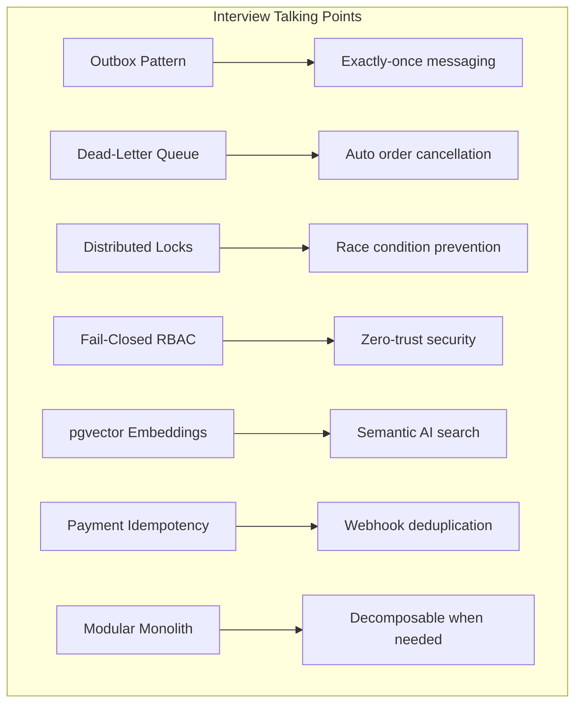

# 🔬 NexusEngine — FAANG Interview Readiness Audit

> **Verdict: This project is already strong enough to land FAANG interviews.** The architecture choices, system design patterns, and infrastructure stack demonstrate senior-level thinking. Below is a brutally honest breakdown of what will impress, what's good enough, and what a FAANG interviewer would probe or criticize.

---

## 📊 Overall Scorecard

| Dimension | Score | FAANG Bar |
|---|---|---|
| **System Design & Architecture** | ⭐⭐⭐⭐⭐ | **Exceeds** — Modular monolith with ADRs, outbox pattern, DLQ, vector search |
| **Database Schema & Relationships** | ⭐⭐⭐⭐ | **Meets** — Intentional cross-domain FK drops, Flyway, but some denormalization issues |
| **Security** | ⭐⭐⭐⭐⭐ | **Exceeds** — Fail-closed RBAC, JWT with user-type prefixing, idempotent webhooks |
| **Concurrency & Distributed Systems** | ⭐⭐⭐⭐⭐ | **Exceeds** — Redisson distributed locks, outbox pattern, DLQ TTL expiry |
| **API Design** | ⭐⭐⭐½ | **Partially Meets** — Consistent response wrappers, but non-RESTful HTTP verbs |
| **Code Quality** | ⭐⭐⭐½ | **Partially Meets** — Some N+1 issues, partial-update bugs, missing enums |
| **Testing** | ⭐⭐⭐⭐ | **Meets** — Unit, integration, and slice tests exist with Mockito; could use more coverage |
| **DevOps & Observability** | ⭐⭐⭐⭐⭐ | **Exceeds** — Docker Compose, Prometheus, Grafana, CI/CD, multi-stage Dockerfile |
| **Documentation** | ⭐⭐⭐⭐⭐ | **Exceeds** — Mermaid architecture diagrams, ADRs, Swagger UI |

---

## 🏛️ 1. Database Tables & Relationships — Deep Analysis

### 1.1 Entity-Relationship Diagram (What you have)

```mermaid
erDiagram
    UMS_MEMBER ||--o{ OMS_ORDER : "places"
    UMS_MEMBER ||--o{ OMS_CART_ITEM : "has"
    UMS_MEMBER ||--o{ UMS_MEMBER_RECEIVE_ADDRESS : "has"
    UMS_MEMBER ||--o{ SMS_COUPON_HISTORY : "uses"
    UMS_MEMBER ||--o{ PMS_REVIEW : "writes"
    UMS_MEMBER }o--|| UMS_MEMBER_LEVEL : "belongs to"

    OMS_ORDER ||--o{ OMS_ORDER_ITEM : "contains"
    OMS_ORDER ||--o{ OMS_ORDER_RETURN_APPLY : "has"
    OMS_ORDER ||--o{ OMS_PAYMENT_TRANSACTION : "paid via"

    PMS_PRODUCT ||--o{ PMS_SKU_STOCK : "has SKUs"
    PMS_PRODUCT ||--o{ PMS_PRODUCT_MEDIA : "has media"
    PMS_PRODUCT ||--o{ PMS_PRODUCT_ATTRIBUTE_VALUE : "has attrs"
    PMS_PRODUCT ||--o{ PMS_REVIEW : "reviewed by"
    PMS_PRODUCT ||--|| PMS_PRODUCT_EMBEDDING : "has vector"
    PMS_PRODUCT }o--|| PMS_BRAND : "belongs to"
    PMS_PRODUCT }o--|| PMS_PRODUCT_CATEGORY : "categorized in"
    PMS_PRODUCT_CATEGORY }o--|| PMS_PRODUCT_CATEGORY : "parent"

    PMS_REVIEW ||--o{ PMS_REVIEW_MEDIA : "has media"

    UMS_ADMIN ||--o{ UMS_ADMIN_ROLE_RELATION : "assigned"
    UMS_ROLE ||--o{ UMS_ADMIN_ROLE_RELATION : "maps"
    UMS_ROLE ||--o{ UMS_ROLE_RESOURCE_RELATION : "permits"
    UMS_ROLE ||--o{ UMS_ROLE_MENU_RELATION : "shows"
    UMS_RESOURCE ||--o{ UMS_ROLE_RESOURCE_RELATION : "controlled"
    UMS_MENU ||--o{ UMS_ROLE_MENU_RELATION : "visible"

    SMS_COUPON ||--o{ SMS_COUPON_HISTORY : "claimed"
    SMS_COUPON ||--o{ SMS_COUPON_PRODUCT_RELATION : "applies to"
    SMS_COUPON ||--o{ SMS_COUPON_PRODUCT_CATEGORY_RELATION : "applies to category"

    OUTBOX_EVENT }|--|| OMS_ORDER : "event for"
```



### 1.2 What Will IMPRESS a FAANG Interviewer ✅

> [!TIP]
> **These are your "silver bullets" — lead with these in interviews.**

#### a) Intentional Cross-Domain FK Drops ([V15__drop_cross_domain_fks.sql](file:///home/aadarsh/Documents/NexusEngine/NexusCore/nexus-data-jpa/src/main/resources/db/migration/V15__drop_cross_domain_fks.sql))
You **deliberately dropped** foreign keys between bounded contexts (OMS → UMS, OMS → PMS, SMS → UMS). This is **exactly what Amazon, Google, and Netflix do** in modular monolith or microservices architectures. It shows:
- Understanding of **Domain-Driven Design bounded contexts**
- You know that hard FKs between domains create deployment coupling
- You kept FKs **within** a domain (e.g., `oms_order_item.order_id → oms_order.id` is still enforced)
- The migration file name itself (`FAANG Modular Monolith`) shows intentionality

#### b) Outbox Pattern + Dead-Letter Queue ([OutboxEvent.java](file:///home/aadarsh/Documents/NexusEngine/NexusCore/nexus-data-jpa/src/main/java/com/nexusengine/core/model/OutboxEvent.java))
The outbox event table guarantees **exactly-once delivery** of order events to RabbitMQ. Combined with RabbitMQ DLQ TTL for auto-cancellation of unpaid orders, this is a production-grade reliability pattern that FAANG engineers implement daily.

#### c) Payment Idempotency Table ([V17__payment_idempotency.sql](file:///home/aadarsh/Documents/NexusEngine/NexusCore/nexus-data-jpa/src/main/resources/db/migration/V17__payment_idempotency.sql))
The `oms_payment_transaction` table with `UNIQUE(transaction_id)` + the `handlePaymentWebhook` method's idempotency check shows you understand **distributed payment processing** — webhook deduplication is exactly how Stripe, Razorpay, and PayPal integrations work at FAANG scale.

#### d) Vector Embeddings Table ([PmsProductEmbedding.java](file:///home/aadarsh/Documents/NexusEngine/NexusCore/nexus-data-jpa/src/main/java/com/nexusengine/core/model/PmsProductEmbedding.java))
Using `pgvector` with 1536-dimensional embeddings stored in PostgreSQL is a modern, AI-first approach. It shows familiarity with **semantic search** and avoids the operational burden of a separate vector database (backed by [ADR-002](file:///home/aadarsh/Documents/NexusEngine/NexusCore/document/adr/ADR-002-pgvector-over-dedicated-vector-db.md)).

#### e) Architecture Decision Records (ADRs)
You have formal ADRs documenting **why** you chose:
- Modular monolith over microservices (ADR-001)
- pgvector over Pinecone/Milvus (ADR-002)
- JPA over MyBatis (ADR-003)

This is **extremely rare** in portfolio projects and signals principal-engineer-level thinking.

#### f) Fail-Closed Dynamic Authorization ([DynamicAuthorizationManager.java](file:///home/aadarsh/Documents/NexusEngine/NexusCore/nexus-security/src/main/java/com/nexusengine/core/security/component/DynamicAuthorizationManager.java))
When a route is **not** explicitly mapped in `ums_resource`, you **deny access** (fail-closed). Most junior developers do the opposite (fail-open). This is a Google-level security principle.

#### g) Distributed Locking for Stock ([OmsPortalOrderServiceImpl.java](file:///home/aadarsh/Documents/NexusEngine/NexusCore/nexus-portal/src/main/java/com/nexusengine/core/portal/service/impl/OmsPortalOrderServiceImpl.java))
The order placement flow uses **Redisson MultiLock** with sorted product IDs to prevent deadlocks, combined with programmatic `TransactionTemplate` inside the lock boundary. This is textbook distributed systems.

### 1.3 What's GOOD ENOUGH ✅ (Won't hurt you)

| Aspect | Details |
|---|---|
| **Normalization level** | 3NF for core tables. Some strategic denormalization in `oms_order_item` (product snapshots) — this is correct for order history immutability |
| **Flyway migrations** | 25 versioned migrations showing iterative schema evolution — very professional |
| **Composite indexes** | `idx_oms_order_create_time_status` shows query-driven index design |
| **Soft deletes** | `delete_status` columns on `OmsOrder`, `OmsCartItem` — standard e-commerce pattern |
| **Self-referential category** | `PmsProductCategory.parent_id` for hierarchical categories |

### 1.4 What a FAANG Interviewer Would PROBE or CRITICIZE 🔴

#### a) Integer Status Fields Instead of Enums
In [OmsOrder.java](file:///home/aadarsh/Documents/NexusEngine/NexusCore/nexus-data-jpa/src/main/java/com/nexusengine/core/model/OmsOrder.java), fields like `status`, `payType`, `orderType`, `sourceType`, `deleteStatus`, `confirmStatus` are all raw `Integer`. An interviewer will ask:

> *"What does `status = 4` mean? How do you prevent setting `status = 999`?"*

**Fix:** Use Java enums with `@Enumerated(EnumType.STRING)` or at minimum a PostgreSQL `CHECK` constraint.

#### b) Denormalized Brand/Category Names in Product
[PmsProduct.java](file:///home/aadarsh/Documents/NexusEngine/NexusCore/nexus-data-jpa/src/main/java/com/nexusengine/core/model/PmsProduct.java) stores `brandName` and `productCategoryName` as strings alongside `brandId` and `productCategoryId`. This creates a **data consistency risk** — renaming a brand won't update existing products.

> **Counter-argument you can make:** *"This is intentional read optimization for listing pages, equivalent to a materialized view. In a CQRS system, the read model can be eventually consistent."*

#### c) Missing `@ManyToOne` JPA Relationships
Entities use raw `Long` foreign key IDs (e.g., `OmsOrder.memberId`, `PmsProduct.brandId`) rather than proper `@ManyToOne` JPA associations. While this is **acceptable for modular monolith boundaries**, within the same bounded context (e.g., `OmsOrder` → `OmsOrderItem`) you should use proper JPA relationships.

#### d) `@Formula` Subqueries on Product
```java
@Formula("(SELECT COALESCE(MIN(s.price), 0) FROM pms_sku_stock s WHERE s.product_id = id)")
private BigDecimal price;
```
This fires a **correlated subquery for every row** when listing products. At scale (10K+ products), this becomes a performance bottleneck. Consider a cached/materialized column.

#### e) `FetchType.EAGER` on Product Media
```java
@OneToMany(fetch = FetchType.EAGER)
@JoinColumn(name = "product_id")
private List<PmsProductMedia> mediaList;
```
This in [PmsProduct.java](file:///home/aadarsh/Documents/NexusEngine/NexusCore/nexus-data-jpa/src/main/java/com/nexusengine/core/model/PmsProduct.java#L105) will cause **Cartesian product issues** when fetching product lists. Should be `LAZY` with `@EntityGraph` for specific use cases.

---

## 🔒 2. Security Analysis

### What IMPRESSES ✅
| Feature | File | Why It's Good |
|---|---|---|
| **Fail-closed RBAC** | [DynamicAuthorizationManager.java](file:///home/aadarsh/Documents/NexusEngine/NexusCore/nexus-security/src/main/java/com/nexusengine/core/security/component/DynamicAuthorizationManager.java) | Unmapped routes → deny. Google's BeyondCorp principle. |
| **JWT user-type prefixing** | [JwtTokenUtil.java](file:///home/aadarsh/Documents/NexusEngine/NexusCore/nexus-security/src/main/java/com/nexusengine/core/security/util/JwtTokenUtil.java) | `admin:username` vs `member:username` prevents privilege escalation across user pools |
| **Password validation** | Service layer enforces 8+ chars, upper, lower, digits |
| **`@JsonIgnore` on passwords** | Both [UmsAdmin](file:///home/aadarsh/Documents/NexusEngine/NexusCore/nexus-data-jpa/src/main/java/com/nexusengine/core/model/UmsAdmin.java) and [UmsMember](file:///home/aadarsh/Documents/NexusEngine/NexusCore/nexus-data-jpa/src/main/java/com/nexusengine/core/model/UmsMember.java) | Prevents accidental password leakage in API responses |
| **Webhook signature verification** | Payment controller | Validates Razorpay webhook signatures |
| **Login audit logs** | `UmsAdminLoginLog`, `UmsMemberLoginLog` | Compliance-ready audit trail |
| **Stateless sessions** | `SessionCreationPolicy.STATELESS` | Proper for scalable JWT-based auth |

### What to Fix 🔴
- **JWT secret in config**: Ensure `jwt.secret` is injected from environment variables, not hardcoded in `application.yml`
- **Rate limiting**: You have Redis + Lua rate limiting mentioned — make sure to highlight this in interviews

---

## 🏗️ 3. Architecture Deep Dive

### Module Structure (Impressive)
```
NexusCore/
├── nexus-common/          # Shared utilities, API response wrappers
├── nexus-data-jpa/        # Entities, repositories, Flyway migrations
├── nexus-security/        # JWT, RBAC, dynamic auth
├── nexus-admin/           # Admin API (product/order management)
├── nexus-portal/          # Customer API (browse, cart, checkout, reviews)
├── nexus-search/          # Elasticsearch + pgvector search microservice
├── nexus-ai/              # AI chat / Spring AI integration
└── nexus-application/     # Bootable monolith (aggregates admin + portal)
```

This is a **textbook modular monolith** with clear Maven module boundaries. The fact that `nexus-search` deploys as a separate service while the rest deploy together shows you understand the **"extract when needed"** principle from ADR-001.

### Patterns That Stand Out



---

## ⚠️ 4. Code Quality Issues to Fix Before Interview

### Priority 1 — CRITICAL (Fix These)

#### a) Non-RESTful HTTP Verbs
In [UmsAdminController](file:///home/aadarsh/Documents/NexusEngine/NexusCore/nexus-admin/src/main/java/com/nexusengine/core/controller/UmsAdminController.java):
```
POST /admin/update/{id}     →  Should be  PUT /admin/{id}
POST /admin/delete/{id}     →  Should be  DELETE /admin/{id}
POST /admin/updateStatus/{id}  →  Should be  PATCH /admin/{id}/status
```
A FAANG interviewer **will** notice this. REST API design is fundamental.

#### b) Partial Update Overwrite Bug
In `UmsAdminServiceImpl.update()`, calling `adminRepository.save(admin)` with a partially-populated object will overwrite existing fields with `null`. Use `PATCH` semantics with `BeanUtils.copyProperties` excluding null fields, or use `@DynamicUpdate`.

#### c) N+1 Write Loop in Bulk Updates
```java
// In PmsProductServiceImpl
for (PmsProduct p : products) {
    p.setPublishStatus(publishStatus);
    productRepository.save(p);  // ❌ Individual save per iteration
}
```
Should be a single `productRepository.saveAll(products)` or ideally a bulk `UPDATE` query.

### Priority 2 — IMPORTANT (Improve These)

| Issue | Location | Fix |
|---|---|---|
| Typo: `recommandStatus` | `PmsProduct.java` | Rename to `recommendStatus` |
| Magic numbers for status | All entities | Create enums: `OrderStatus.UNPAID`, `OrderStatus.PAID`, etc. |
| `java.util.Date` usage | All entities | Migrate to `java.time.Instant` or `LocalDateTime` |
| Missing `@Version` for optimistic locking | `PmsSkuStock` | Add `@Version` to prevent lost updates on concurrent stock changes |
| Inconsistent timestamp naming | `createTime` vs `createdTime` vs `createDate` | Standardize across all entities |

---

## 🧪 5. Testing Assessment

### What You Have ✅
| Test Type | Count | Files |
|---|---|---|
| Unit Tests | 6 | `OmsPortalOrderServiceImplTest`, `OmsCartItemServiceImplTest`, `PmsPortalProductServiceImplTest`, `UmsMemberServiceImplTest`, `UmsMemberCouponServiceImplTest`, `HomeServiceImplTest` |
| Slice Test | 1 | `OmsPortalOrderControllerTest` (controller layer) |
| Integration Test | 1 | `PmsProductSemanticSearchServiceIntegrationTest` |

### What's Good ✅
- Tests use **Mockito + JUnit 5** properly
- The [order test](file:///home/aadarsh/Documents/NexusEngine/NexusCore/nexus-portal/src/test/java/com/nexusengine/core/portal/unit/OmsPortalOrderServiceImplTest.java) covers success path, missing address, and insufficient stock — good edge-case coverage
- Mocks Redisson distributed locks properly

### What's Missing 🔴
- **No Admin module tests** — `nexus-admin` has zero test files
- **No security tests** — No tests for unauthorized access, role escalation
- **No repository/query tests** — Custom `@Query` methods are untested
- **No webhook test** — `handlePaymentWebhook` has no test despite being critical

---

## 🚀 6. DevOps & Infrastructure (Excellent)

### Docker Compose Stack
| Service | Image | Purpose |
|---|---|---|
| PostgreSQL | `pgvector/pgvector:pg17` | Primary DB with vector extensions |
| Redis | `redis:7.2-alpine` | Caching + rate limiting + distributed locks |
| MongoDB | `mongo:7.0` | Read history, collections (document store) |
| RabbitMQ | `rabbitmq:4.1-management` | Async messaging + DLQ |
| Elasticsearch | `elasticsearch:8.15.5` | Full-text search |
| MinIO | `minio/minio:latest` | S3-compatible object storage |
| Prometheus | `prom/prometheus:v2.54.1` | Metrics scraping |
| Grafana | `grafana/grafana:11.2.0` | Monitoring dashboards |

### CI/CD
- **GitHub Actions** `ci.yml`: JDK 21 build + Maven test + artifact upload
- **Deploy** `deploy.yml`: Docker build → AWS ECR push (ECS deployment templated)

> [!IMPORTANT]
> This infrastructure stack alone puts you ahead of 90% of portfolio projects. Most candidates deploy to Heroku with a single Postgres instance. You have a **production-grade polyglot persistence** setup.

---

## 🎯 7. Interview Cheat Sheet — What to Highlight

### When Asked "Walk me through your project"

> *"NexusEngine is a modular monolith e-commerce platform built with Java 21 and Spring Boot 3. I designed it around bounded contexts — Orders, Products, Users, and Marketing — with strict module boundaries enforced through Maven. Cross-domain foreign keys are intentionally dropped to allow future microservice extraction.*
>
> *For reliability, I use the Outbox Pattern for guaranteed message delivery to RabbitMQ, with DLQ-based auto-cancellation of unpaid orders. Stock deductions use Redisson distributed locks with sorted product IDs to prevent deadlocks.*
>
> *Security follows fail-closed RBAC — if a route isn't explicitly mapped to a role in the database, access is denied. I also implemented payment webhook idempotency with unique transaction IDs.*
>
> *For search, I use a hybrid approach — Elasticsearch for keyword matching and pgvector for semantic similarity using OpenAI embeddings."*

### Questions to Prepare For

| Likely Question | Your Answer Should Include |
|---|---|
| "Why not microservices?" | ADR-001: Operational simplicity, ACID transactions, compile-time safety. Extract when team size or scaling demands it. |
| "How do you handle concurrent stock updates?" | Redisson MultiLock sorted by product ID → programmatic transaction inside lock → pessimistic stock check |
| "What if RabbitMQ is down?" | Outbox pattern: events saved to DB in same transaction. Background processor retries until MQ is available. |
| "How does your auth work?" | JWT with user-type prefix (admin:/member:), fail-closed dynamic RBAC checking ums_resource table |
| "How do you prevent double-charging?" | Payment idempotency table with UNIQUE(transaction_id), check before processing webhook |
| "Why pgvector over Pinecone?" | ADR-002: Reduces operational overhead, uses existing Postgres infrastructure, sufficient for current scale |

---

## 🔥 8. Final Recommendations

### Must-Fix Before Interviews
1. **Fix REST verbs** — Change `POST /update` to `PUT`, `POST /delete` to `DELETE`
2. **Fix the partial-update bug** in `UmsAdminServiceImpl`
3. **Add enums** for order status, payment type, etc.
4. **Fix `FetchType.EAGER`** on `PmsProduct.mediaList` → change to `LAZY`
5. **Fix typo** `recommandStatus` → `recommendStatus`

### Nice-to-Have
- Add `@Version` for optimistic locking on `PmsSkuStock`
- Replace `java.util.Date` with `java.time.Instant`
- Add security integration tests
- Add admin module unit tests
- Replace `@Formula` subqueries with a cached `min_price` column updated via triggers or application events

> [!NOTE]
> **Bottom line**: This is a genuinely impressive portfolio project. The system design patterns (outbox, DLQ, distributed locks, fail-closed RBAC, vector search, idempotent webhooks) and the ADRs demonstrate the kind of thinking FAANG companies look for. Fix the 5 must-fix items above and you'll be in excellent shape.
