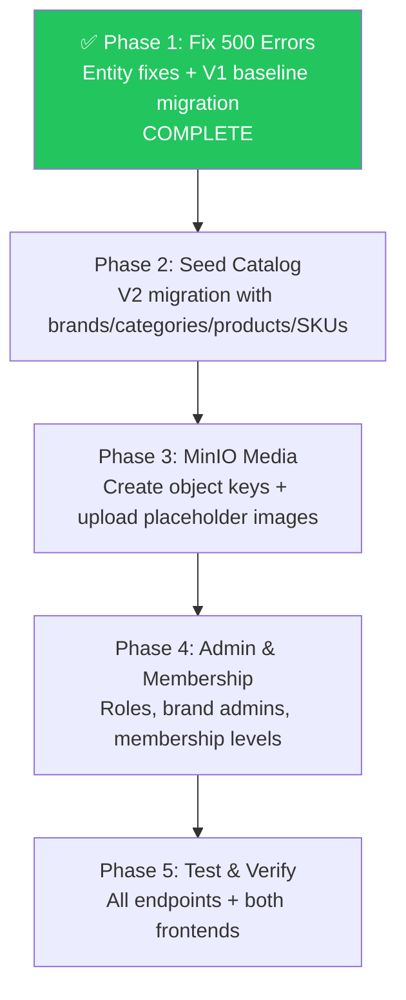

# NexusEngine Master Execution Plan

> **Project**: NexusEngine — Modular Monolith E-Commerce Platform
> **Stack**: Spring Boot 3.5.14 / Java 21 + React 19 + PostgreSQL 17 (pgvector) + MinIO + Redis + RabbitMQ + Elasticsearch
> **Created**: 2026-09-17
> **Status**: 🟡 In Progress — Phase 1 Complete

---

## 📋 Executive Summary

This plan covers **4 major workstreams** to make NexusEngine a FAANG-interview-ready e-commerce platform:

1. **~~Fix 500 Errors~~** ✅ — Entity↔DB column mismatches fixed, Flyway reset to V1 baseline
2. **Seed Full Catalog** — 8 top-level categories, ~50 brands, ~150 products, ~400 SKUs
3. **MinIO Media Architecture** — Enterprise-grade object key structure with placeholder images
4. **Admin Roles & Membership System** — Super Admin, Brand Admins, Membership Tiers

---

## 🔍 Root Cause Analysis — 500 Errors ✅ RESOLVED

> [!NOTE]
> All 500 errors were caused by entity-to-column mapping mismatches. These have been fully resolved by fixing the entity code, consolidating all 23 Flyway migrations (V2–V29) into a single V1 baseline, and cleaning up the database.

### What Was Fixed

| Issue | Resolution |
|---|---|
| `PmsProduct.freightTemplateId` → column didn't exist | Removed field from entity, dropped column from DB |
| `PmsProduct.recommendStatus` → DB had `recommand_status` | DB already had `recommend_status`; entity was correct; V1 baseline uses `recommend_status` |
| `PmsFreightTemplate` entity → table dropped in V21 | Deleted entity + repository (table never recreated) |
| `PmsSkuStock.spData` → `sku_attributes` | Already correct in entity; V1 baseline uses `sku_attributes` |
| `UmsMemberLevel` duplicate old columns | V1 baseline only creates new column names |
| Flyway V25/V26/V27 out-of-order validation failure | All migrations consolidated into V1 baseline; `flyway_schema_history` cleared |
| `seed.sql` using stale column/table names | Updated to match final schema |

### Files Changed

| File | Change |
|---|---|
| [`PmsProduct.java`](file:///home/aadarsh/Documents/NexusEngine/NexusCore/nexus-data-jpa/src/main/java/com/nexusengine/core/model/PmsProduct.java) | Removed `freightTemplateId` field |
| `PmsFreightTemplate.java` | **Deleted** — orphaned entity |
| `PmsFreightTemplateRepository.java` | **Deleted** — orphaned repository |
| [`V1__baseline.sql`](file:///home/aadarsh/Documents/NexusEngine/NexusCore/nexus-data-jpa/src/main/resources/db/migration/V1__baseline.sql) | New consolidated baseline (660 lines, 48 tables) |
| V2–V29 migration files | **Deleted** (23 files) |
| [`application.yml`](file:///home/aadarsh/Documents/NexusEngine/NexusCore/nexus-application/src/main/resources/application.yml) | `baseline-version: 0`, added `out-of-order: true` |
| [`application-dev.yml`](file:///home/aadarsh/Documents/NexusEngine/NexusCore/nexus-application/src/main/resources/application-dev.yml) | Same Flyway config |
| [`seed.sql`](file:///home/aadarsh/Documents/NexusEngine/NexusCore/document/sql/seed.sql) | Fixed all stale column/table references |

---

## Phase 1: Fix 500 Errors ✅ COMPLETE

### Task 1.1: Fix `PmsProduct` Column Mappings
- [x] Removed `freightTemplateId` field — column was dropped in old V28, never recreated
- [x] `recommend_status` was already correct in entity — DB column confirmed as `recommend_status`

### Task 1.2: Fix All Entity-DB Mismatches
- [x] Audited all 49 entity `@Column` annotations against actual DB column names
- [x] `PmsSkuStock.spData` correctly maps to `sku_attributes` ✅
- [x] `UmsMemberLevel` column mappings all correct ✅
- [x] `OmsOrder.rewardPoints`/`experiencePoints` correctly use JPA implicit naming ✅
- [x] Deleted `PmsFreightTemplate` entity + repository (table dropped, never recreated)

### Task 1.3: Flyway Migration Reset (replaces original V25 plan)
- [x] Consolidated all 23 migrations (V2–V29) into single `V1__baseline.sql`
- [x] Deleted all old migration files (V2–V29)
- [x] Updated Flyway config: `baseline-version: 0`, `out-of-order: true`
- [x] Cleared `flyway_schema_history` table in database
- [x] Dropped orphaned `freight_template_id` column from DB

### Task 1.4: Verified Application Starts ✅
- [x] `mvn clean install -DskipTests` — BUILD SUCCESS
- [x] `mvn spring-boot:run -pl nexus-application` — starts without errors
- [x] `GET /actuator/health` → `{"status": "UP"}` ✅

### Task 1.5: Updated Seed Script
- [x] Fixed `seed.sql` — removed dropped columns, updated renamed columns/tables

---

## Phase 2: Seed Full E-Commerce Catalog (Flyway V2)

> [!IMPORTANT]
> With the Flyway reset, the next migration is now **V2** (not V26). All future migrations start from V2.

### Task 2.1: Brands (~50 brands across 8 categories)

```
Electronics: Apple, Samsung, Google, Sony, OnePlus, Nothing, Dell, Lenovo, ASUS, Logitech, boAt, Noise, Portronics, Zebronics, Lava, Micromax

Fashion: Nike, Adidas, Puma, Levi's, Uniqlo, Zara, H&M, Ray-Ban, The North Face, FabIndia, Manyavar, W for Woman, Allen Solly, Peter England, Raymond, Van Heusen

Home & Kitchen: IKEA, Philips, Dyson, LG, Bosch, Prestige, Hawkins, KENT, Bajaj, Havells, Usha, Butterfly, Crompton, Wonderchef

Beauty: L'Oréal, Maybelline, Nivea, Clinique, The Ordinary, Dove, Neutrogena, Lakmé, Mamaearth, Minimalist, Forest Essentials, Plum, Nykaa, Biotique

Sports: Under Armour, Decathlon, Wilson, Yonex, Nivia, Cosco, SS (Sareen Sports), SG (Sanspareils Greenlands), Vector X

Books: Penguin Random House, O'Reilly, McGraw Hill, Pearson, Moleskine, Rupa Publications, S. Chand, Arihant, Amar Chitra Katha, Crossword

Grocery: Nestlé, Coca-Cola, Kellogg's, Unilever, Britannia, Tata, Amul, Parle, ITC, Dabur, Patanjali, Mother Dairy, Aashirvaad, Fortune, MTR

Automotive: Michelin, Castrol, 3M, Motul, CEAT, MRF, Apollo Tyres, TVS, Bosch India, Gulf Oi
```

### Task 2.2: Categories (8 top-level + ~35 subcategories)

```
Electronics (L0)
├── Smartphones (L1)
├── Laptops (L1)
├── Tablets (L1)
├── Headphones & Earbuds (L1)
├── Smartwatches (L1)
├── Cameras (L1)
├── Monitors (L1)
└── Keyboards & Mice (L1)

Fashion (L0)
├── Men's Clothing (L1)
├── Women's Clothing (L1)
├── Footwear (L1)
└── Accessories (L1)

Home & Kitchen (L0)
├── Furniture (L1)
├── Kitchen Appliances (L1)
├── Home Appliances (L1)
└── Kitchenware (L1)

Beauty & Personal Care (L0)
├── Skincare (L1)
├── Hair Care (L1)
├── Makeup (L1)
└── Grooming (L1)

Sports & Fitness (L0)
├── Running (L1)
├── Gym Equipment (L1)
├── Yoga (L1)
└── Outdoor (L1)

Books & Stationery (L0)
├── Fiction (L1)
├── Non-Fiction (L1)
├── Technology (L1)
└── Notebooks & Supplies (L1)

Grocery (L0)
├── Beverages (L1)
├── Snacks (L1)
├── Breakfast (L1)
└── Pantry (L1)

Automotive (L0)
├── Car Accessories (L1)
├── Car Care (L1)
└── Replacement Parts (L1)
```

### Task 2.3: Product Attribute Categories & Attributes

| Attr Category | Attributes (type=0, SKU variants) | For Products |
|---|---|---|
| Smartphone Specs | Color, Storage | Phones, Tablets |
| Laptop Specs | RAM, Storage, Color | Laptops |
| Audio Specs | Color | Headphones |
| Shoe Sizes | Size (US), Color | Footwear |
| Apparel Sizes | Size (S/M/L/XL), Color | Clothing |
| Beauty Shades | Shade | Foundation, Lipstick |
| Book Editions | Format (Paperback/Hardcover/Kindle) | Books |
| Grocery Pack | Pack Size | Grocery items |
| Display Specs | Size (inches), Resolution | Monitors |
| General Variants | Color | Generic products |

### Task 2.4: Products (~150 products with varied SKU patterns)

**Variant patterns to demonstrate:**

| Pattern | Example Product | SKUs |
|---|---|---|
| Color + Storage | iPhone 17 | Black/128, Black/256, Silver/128, Silver/256 |
| Color + Size | Nike Air Max | Black/8, Black/9, Black/10, White/8, White/9 |
| Shade | Maybelline Foundation | Shade 110, 120, 130, 220 |
| Format | Clean Code Book | Paperback, Hardcover, Kindle |
| Pack Size | Coca-Cola | 300ml, 750ml, 1.25L, 2.25L |
| Size only | Uniqlo T-Shirt | S, M, L, XL |
| Color only | Sony WH-1000XM6 | Black, Silver, Blue |
| No variants | Dyson V15 Vacuum | Single SKU |
| Capacity | Bosch Dishwasher | 12-place, 14-place |

### Task 2.5: SKU Stock (~400 SKUs)
- [ ] Each SKU with realistic pricing, stock levels, and JSONB `sku_attributes`
- [ ] SKU codes following pattern: `{BRAND}-{PRODUCT}-{VARIANT}` (e.g., `APPLE-IP17-BLK-256`)
- [ ] Promotion prices for select SKUs

### Task 2.6: Product Media
- [ ] Populate `pms_product_media` with MinIO URLs for each product
- [ ] `sort_order` for gallery ordering

### Task 2.7: Banners & Marketing
- [ ] Update `sys_banner` with category-appropriate banners
- [ ] Add banners for each major category

### Task 2.8: Product Attribute Values
- [ ] Populate `pms_product_attribute_value` for all products
- [ ] Link attributes to products for the variant picker to work

---

## Phase 3: MinIO Media Architecture

### Task 3.1: Create MinIO Bucket Structure
- [ ] Use `mc` CLI or S3 API to create the following key structure using `image1.jpeg` as placeholder

```
nexus-media/public/catalog/brands/{id}-{slug}/logo.webp
nexus-media/public/catalog/brands/{id}-{slug}/banner.webp
nexus-media/public/catalog/categories/{id}-{slug}/icon.svg
nexus-media/public/catalog/products/{id}-{slug}/main.webp
nexus-media/public/catalog/products/{id}-{slug}/gallery/01.webp
nexus-media/public/catalog/skus/{SKU_CODE}/main.webp
nexus-media/public/catalog/skus/{SKU_CODE}/swatch.webp
nexus-media/public/marketing/banners/{banner-slug}.webp
nexus-media/public/users/avatars/default/avatar.webp
```

### Task 3.2: Set Bucket Policy
- [ ] Set public read policy on `nexus-media/public/*`
```json
{
  "Version": "2012-10-17",
  "Statement": [
    {
      "Effect": "Allow",
      "Principal": {"AWS": ["*"]},
      "Action": ["s3:GetObject"],
      "Resource": ["arn:aws:s3:::nexus-media/public/*"]
    }
  ]
}
```

### Task 3.3: Update DB URLs to Match New Structure
- [ ] All product `pic` fields → `http://localhost:9000/nexus-media/public/catalog/products/{id}-{slug}/main.webp`
- [ ] All brand `logo` fields → `http://localhost:9000/nexus-media/public/catalog/brands/{id}-{slug}/logo.webp`
- [ ] All brand `big_pic` fields → `http://localhost:9000/nexus-media/public/catalog/brands/{id}-{slug}/banner.webp`
- [ ] All category `icon` fields → `http://localhost:9000/nexus-media/public/catalog/categories/{id}-{slug}/icon.svg`
- [ ] All SKU `pic` fields → `http://localhost:9000/nexus-media/public/catalog/skus/{SKU_CODE}/main.webp`
- [ ] All banner `pic` fields → `http://localhost:9000/nexus-media/public/marketing/banners/{slug}.webp`
- [ ] All `pms_product_media` entries → MinIO gallery URLs

---

## Phase 4: Admin Roles & Membership System

### Task 4.1: Super Admin Enhancement
- [ ] Ensure `admin` (ID=1) user has `vendorId = NULL` (unrestricted, platform-level)
- [ ] The admin panel already checks `username === 'admin'` for superuser bypass
- [ ] Set `admin` status = 1 (enabled)

### Task 4.2: Brand Admin Accounts
- [ ] Create admin accounts per major brand with `vendorId` set
- [ ] Each brand admin can only see/manage their brand's products
- [ ] Already supported via `PmsProductServiceImpl.findByVendorId()`

```
apple_admin (vendorId = 1, role = Product Manager)
samsung_admin (vendorId = 2, role = Product Manager)
nike_admin (vendorId = 3, role = Product Manager)
```

### Task 4.3: Membership Levels
- [ ] Populate `ums_member_level` with tiered membership system:

| Level | Name | Growth Points | Free Shipping | VIP Pricing | Birthday Perk |
|---|---|---|---|---|---|
| 1 | Bronze (Default) | 0 | No | No | No |
| 2 | Silver | 1000 | ₹499+ | 3% off | No |
| 3 | Gold | 5000 | ₹299+ | 5% off | Yes |
| 4 | Platinum | 15000 | Free | 8% off | Yes |
| 5 | Diamond | 50000 | Free | 12% off | Yes |

### Task 4.4: UMS Role-Based Access Control
- [ ] Ensure existing roles (Super Admin, Product Manager, Order Manager, etc.) have proper menu/resource assignments
- [ ] Create `ums_role_menu_relation` entries for each role
- [ ] Create `ums_role_resource_relation` entries for API access control

---

## Phase 5: Testing & Verification

### Task 5.1: API Endpoint Verification
- [ ] `GET /portal/home/content` → 200 with products, brands, banners
- [ ] `GET /portal/home/recommendProductList` → 200 with paginated products
- [ ] `GET /portal/product/detail/{id}` → 200 with full product detail + SKUs
- [ ] `GET /portal/product/search?keyword=iPhone` → 200 with search results
- [ ] `GET /portal/product/categoryTreeList` → 200 with full category tree
- [ ] `GET /product/list` (admin) → 200 with all products
- [ ] `GET /brand/list` (admin) → 200 with all brands
- [ ] `GET /productCategory/list/withChildren` (admin) → 200 with category hierarchy

### Task 5.2: Frontend Verification
- [ ] Customer frontend (port 5173) loads homepage with products, banners
- [ ] Product detail page shows variant picker, gallery, reviews
- [ ] Admin panel (port 5174) shows product list with images
- [ ] Admin panel shows brand list
- [ ] Admin panel shows category hierarchy

---

## 📐 Execution Order



---

## 📁 Flyway Migration Plan

> [!IMPORTANT]
> Migrations have been reset. V1 is the consolidated baseline. All future migrations start from V2.

| File | Purpose | Status |
|---|---|---|
| `V1__baseline.sql` | Consolidated schema (48 tables, indexes) | ✅ Created |
| `V2__seed_full_catalog.sql` | Full catalog seed (brands, categories, products, SKUs, attributes, media, banners) | ⬜ Pending |
| `V3__membership_and_admin.sql` | Membership tiers, brand admin accounts, role assignments | ⬜ Pending |

---

## 📊 Current Database State

| Table | Current Rows | Target Rows |
|---|---|---|
| `pms_brand` | 3 (Apple, Sony, Nike) | ~50 |
| `pms_product_category` | 5 (Electronics, Smartphones, Headphones, Clothing, Sneakers) | ~43 |
| `pms_product` | 3 (iPhone 15 Pro, Sony XM5, Nike Air Max) | ~150 |
| `pms_sku_stock` | 6 | ~400 |
| `pms_product_attribute_category` | 3 | ~10 |
| `pms_product_attribute` | 4 | ~20 |
| `pms_product_attribute_value` | ? | ~300 |
| `pms_product_media` | ? | ~450 |
| `sys_banner` | 2 | ~8 |
| `ums_member_level` | 1 (Gold) | 5 (Bronze→Diamond) |
| `ums_admin` | 11 | ~15 (+ brand admins) |

---

> [!TIP]
> **Next step**: Phase 2 — Seed the full e-commerce catalog via `V2__seed_full_catalog.sql`. This will populate ~50 brands, ~150 products, and ~400 SKUs.
