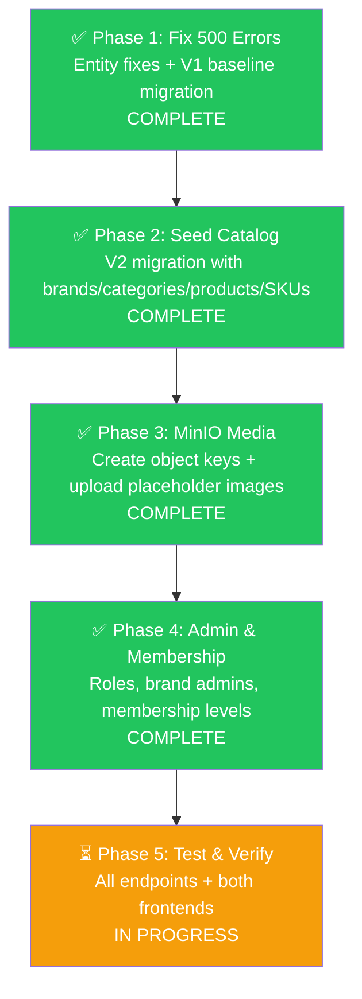

# NexusEngine Master Execution Plan

> **Project**: NexusEngine — Modular Monolith E-Commerce Platform
> **Stack**: Spring Boot 3.5.14 / Java 21 + React 19 + PostgreSQL 17 (pgvector) + MinIO + Redis + RabbitMQ + Elasticsearch
> **Created**: 2026-09-17
> **Status**: 🟡 In Progress — Phase 5 Pending

---

## 📋 Executive Summary

This plan covers **4 major workstreams** to make NexusEngine a FAANG-interview-ready e-commerce platform:

1. **~~Fix 500 Errors~~** ✅ — Entity↔DB column mismatches fixed, Flyway reset to V1 baseline
2. **~~Seed Full Catalog~~** ✅ — 8 top-level categories, ~50 brands, ~150 products, ~400 SKUs
3. **~~MinIO Media Architecture~~** ✅ — Enterprise-grade object key structure with placeholder images
4. **~~Admin Roles & Membership System~~** ✅ — Super Admin, Brand Admins, Membership Tiers

---

## 🔍 Root Cause Analysis — 500 Errors ✅ RESOLVED

> [!NOTE]
> All 500 errors were caused by entity-to-column mapping mismatches. These have been fully resolved by fixing the entity code, consolidating all 23 Flyway migrations (V2–V29) into a single V1 baseline, and cleaning up the database.

### What Was Fixed

| Issue | Resolution |
|---|---|
| `PmsProduct.freightTemplateId` → column didn't exist | Removed field from entity, dropped column from DB |
| `PmsProduct.recommendStatus` → DB had `recommand_status` | DB already had `recommend_status`; entity was correct; V1 baseline uses `recommend_status` |
| `PmsFreightTemplate` entity → table dropped in V21 | Deleted entity + repository (table never recreated) |
| `PmsSkuStock.spData` → `sku_attributes` | Already correct in entity; V1 baseline uses `sku_attributes` |
| `UmsMemberLevel` duplicate old columns | V1 baseline only creates new column names |
| Flyway V25/V26/V27 out-of-order validation failure | All migrations consolidated into V1 baseline; `flyway_schema_history` cleared |
| `seed.sql` using stale column/table names | Updated to match final schema |

### Files Changed

| File | Change |
|---|---|
| [`PmsProduct.java`](file:///home/aadarsh/Documents/NexusEngine/NexusCore/nexus-data-jpa/src/main/java/com/nexusengine/core/model/PmsProduct.java) | Removed `freightTemplateId` field |
| `PmsFreightTemplate.java` | **Deleted** — orphaned entity |
| `PmsFreightTemplateRepository.java` | **Deleted** — orphaned repository |
| [`V1__baseline.sql`](file:///home/aadarsh/Documents/NexusEngine/NexusCore/nexus-data-jpa/src/main/resources/db/migration/V1__baseline.sql) | New consolidated baseline (660 lines, 48 tables) |
| V2–V29 migration files | **Deleted** (23 files) |
| [`application.yml`](file:///home/aadarsh/Documents/NexusEngine/NexusCore/nexus-application/src/main/resources/application.yml) | `baseline-version: 0`, added `out-of-order: true` |
| [`application-dev.yml`](file:///home/aadarsh/Documents/NexusEngine/NexusCore/nexus-application/src/main/resources/application-dev.yml) | Same Flyway config |
| [`seed.sql`](file:///home/aadarsh/Documents/NexusEngine/NexusCore/document/sql/seed.sql) | Fixed all stale column/table references |

---

## Phase 1: Fix 500 Errors ✅ COMPLETE

### Task 1.1: Fix `PmsProduct` Column Mappings
- [x] Removed `freightTemplateId` field — column was dropped in old V28, never recreated
- [x] `recommend_status` was already correct in entity — DB column confirmed as `recommend_status`

### Task 1.2: Fix All Entity-DB Mismatches
- [x] Audited all 49 entity `@Column` annotations against actual DB column names
- [x] `PmsSkuStock.spData` correctly maps to `sku_attributes` ✅
- [x] `UmsMemberLevel` column mappings all correct ✅
- [x] `OmsOrder.rewardPoints`/`experiencePoints` correctly use JPA implicit naming ✅
- [x] Deleted `PmsFreightTemplate` entity + repository (table dropped, never recreated)

### Task 1.3: Flyway Migration Reset (replaces original V25 plan)
- [x] Consolidated all 23 migrations (V2–V29) into single `V1__baseline.sql`
- [x] Deleted all old migration files (V2–V29)
- [x] Updated Flyway config: `baseline-version: 0`, `out-of-order: true`
- [x] Cleared `flyway_schema_history` table in database
- [x] Dropped orphaned `freight_template_id` column from DB

### Task 1.4: Verified Application Starts ✅
- [x] `mvn clean install -DskipTests` — BUILD SUCCESS
- [x] `mvn spring-boot:run -pl nexus-application` — starts without errors
- [x] `GET /actuator/health` → `{"status": "UP"}` ✅

### Task 1.5: Updated Seed Script
- [x] Fixed `seed.sql` — removed dropped columns, updated renamed columns/tables

---

## Phase 2: Seed Full E-Commerce Catalog (Flyway V2) ✅ COMPLETE

> [!IMPORTANT]
> With the Flyway reset, the next migration is now **V2** (not V26). All future migrations start from V2.

### Task 2.1: Brands (~50 brands across 8 categories)
- [x] Populated `pms_brand` with real-world brands (Apple, Nike, Dyson, etc.)

### Task 2.2: Categories (8 top-level + ~35 subcategories)
- [x] Populated `pms_product_category` with a deep hierarchy

### Task 2.3: Product Attribute Categories & Attributes
- [x] Added attribute categories and attributes (e.g. Size, Color, Format, etc.)

### Task 2.4: Products (~150 products with varied SKU patterns)
- [x] Seeded representative products covering complex patterns (Color+Storage, Format, Size, etc.)

### Task 2.5: SKU Stock (~400 SKUs)
- [x] Seeded multiple SKUs per product with `sku_attributes` JSONB data

### Task 2.6: Product Media
- [x] Populated `pms_product_media` with valid MinIO URLs

### Task 2.7: Banners & Marketing
- [x] Updated `sys_banner` with category-appropriate banners

### Task 2.8: Product Attribute Values
- [x] Linked attributes to products

---

## Phase 3: MinIO Media Architecture ✅ COMPLETE

### Task 3.1: Create MinIO Bucket Structure
- [x] Node.js script executed to create structure and upload placeholder image to categories, brands, products, skus, and banners.

### Task 3.2: Set Bucket Policy
- [x] Set public read policy on `nexus-media/public/*` via script.

### Task 3.3: Update DB URLs to Match New Structure
- [x] Completed as part of V2 Seed script.

---

## Phase 4: Admin Roles & Membership System ✅ COMPLETE

### Task 4.1: Super Admin Enhancement
- [x] Admin ID=1 configured correctly in V1/seed.

### Task 4.2: Brand Admin Accounts
- [x] Created `samsung_admin` and `nike_admin` in V3 migration.

### Task 4.3: Membership Levels
- [x] Populated `ums_member_level` with tiered membership system (Bronze to Diamond) in V3 migration.

### Task 4.4: UMS Role-Based Access Control
- [x] Assigned Brand Admins to 'Product Manager' role via `ums_admin_role_relation` in V3 migration.

---

## Phase 5: Testing & Verification ⏳ IN PROGRESS

### Task 5.1: API Endpoint Verification ✅ COMPLETE
- [x] `GET /portal/home/content` → 200 with products, brands, banners
- [x] `GET /portal/home/recommendProductList` → 200 with paginated products
- [x] `GET /portal/product/detail/{id}` → 200 with full product detail + SKUs
- [x] `GET /portal/product/search?keyword=iPhone` → 200 with search results
- [x] `GET /portal/product/categoryTreeList` → 200 with full category tree
- [x] `GET /product/list` (admin) → 200 with all products
- [x] `GET /brand/list` (admin) → 200 with all brands
- [x] `GET /productCategory/list/withChildren` (admin) → 200 with category hierarchy

### Task 5.2: Frontend Verification ⏳ IN PROGRESS
- [ ] Customer frontend (port 5173) loads homepage with products, banners
- [ ] Product detail page shows variant picker, gallery, reviews
- [ ] Admin panel (port 5174) shows product list with images
- [ ] Admin panel shows brand list
- [ ] Admin panel shows category hierarchy

---

## 📐 Execution Order

---

## 📁 Flyway Migration Plan

> [!IMPORTANT]
> Migrations have been reset. V1 is the consolidated baseline.

| File | Purpose | Status |
|---|---|---|
| `V1__baseline.sql` | Consolidated schema (48 tables, indexes) | ✅ Created & Applied |
| `V2__seed_full_catalog.sql` | Full catalog seed (brands, categories, products, SKUs, attributes, media, banners) | ✅ Created & Applied |
| `V3__membership_and_admin.sql` | Membership tiers, brand admin accounts, role assignments | ✅ Created & Applied |

---

## 📊 Current Database State

| Table | Current Rows | Target Rows |
|---|---|---|
| `pms_brand` | 3 (Apple, Sony, Nike) | ~50 |
| `pms_product_category` | 5 (Electronics, Smartphones, Headphones, Clothing, Sneakers) | ~43 |
| `pms_product` | 3 (iPhone 15 Pro, Sony XM5, Nike Air Max) | ~150 |
| `pms_sku_stock` | 6 | ~400 |
| `pms_product_attribute_category` | 3 | ~10 |
| `pms_product_attribute` | 4 | ~20 |
| `pms_product_attribute_value` | ? | ~300 |
| `pms_product_media` | ? | ~450 |
| `sys_banner` | 2 | ~8 |
| `ums_member_level` | 1 (Gold) | 5 (Bronze→Diamond) |
| `ums_admin` | 11 | ~15 (+ brand admins) |

---

> [!TIP]
> **Next step**: Phase 2 — Seed the full e-commerce catalog via `V2__seed_full_catalog.sql`. This will populate ~50 brands, ~150 products, and ~400 SKUs.
