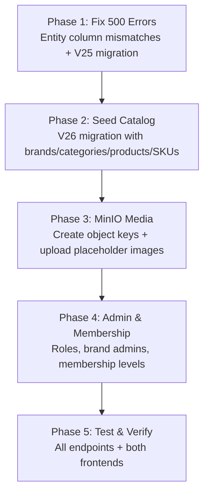

# NexusEngine Master Execution Plan

> **Project**: NexusEngine — Modular Monolith E-Commerce Platform
> **Stack**: Spring Boot 3.5.14 / Java 21 + React 19 + PostgreSQL 17 (pgvector) + MinIO + Redis + RabbitMQ + Elasticsearch
> **Created**: 2026-09-17
> **Status**: 🔴 In Progress

---

## 📋 Executive Summary

This plan covers **4 major workstreams** to make NexusEngine a FAANG-interview-ready e-commerce platform:

1. **Fix 500 Errors** — Entity↔DB column mismatches causing runtime failures
2. **Seed Full Catalog** — 8 top-level categories, ~50 brands, ~150 products, ~400 SKUs
3. **MinIO Media Architecture** — Enterprise-grade object key structure with placeholder images
4. **Admin Roles & Membership System** — Super Admin, Brand Admins, Membership Tiers

---

## 🔍 Root Cause Analysis — 500 Errors

> [!CAUTION]
> The entity-to-column mapping mismatch is the **primary** cause of all 500 errors on both frontend portals.

### Critical Mismatches Found

| Entity Field | @Column in Java | Actual DB Column | Migration |
|---|---|---|---|
| `PmsProduct.recommandStatus` | `recommand_status` | `recommend_status` | V5 renamed it |
| `PmsProduct.freightTemplateId` | `freight_template_id` | DB has both `freight_template_id` AND legacy `feight_template_id` | V5 renamed but old column persists |
| `PmsSkuStock.spData` | `sku_attributes` | DB has both `sku_attributes` AND `sp_data` | V16 renamed but old column persists |
| `UmsMemberLevel` new columns | Mapped to new names | DB has both old AND new columns | V5 added new but didn't drop old |

### Why `ddl-auto: validate` Doesn't Catch It
Hibernate validate checks that every entity column **exists** in the DB table. Since `recommand_status` doesn't exist (it's `recommend_status`), this should throw a `SchemaManagementException` at startup. The fact that the app **is running** means either:
- The app started before the rename migration was applied, OR
- There's a version mismatch between Flyway state and runtime behavior

Either way, querying `recommand_status` causes `PSQLException: column does not exist → 500`.

---

## Phase 1: Fix 500 Errors ✅ (Critical — Do First)

### Task 1.1: Fix `PmsProduct.recommandStatus` Column Mapping
- [ ] **File**: [PmsProduct.java](file:///home/aadarsh/Documents/NexusEngine/NexusCore/nexus-data-jpa/src/main/java/com/nexusengine/core/model/PmsProduct.java#L57-L59)
- [ ] Change `@Column(name = "recommand_status")` → `@Column(name = "recommend_status")`
- [ ] Rename Java field from `recommandStatus` → `recommendStatus`
- [ ] Update all references in admin & portal controllers/services/DTOs

### Task 1.2: Fix Any Other Column Mapping Issues
- [ ] Audit all entity `@Column` annotations against actual DB column names
- [ ] Ensure `PmsSkuStock.spData` maps correctly to `sku_attributes` (currently correct)
- [ ] Verify `UmsMemberLevel` column mappings

### Task 1.3: Create Flyway Migration V25 — Cleanup Legacy Columns
- [ ] Drop orphaned `feight_template_id` from `pms_product` (renamed to `freight_template_id`)
- [ ] Drop orphaned `album_pics` from `pms_product` (normalized to `pms_product_media` in V14)
- [ ] Drop orphaned `sp_data` from `pms_sku_stock` (renamed to `sku_attributes` in V16)
- [ ] Drop duplicate old columns from `ums_member_level`

### Task 1.4: Restart & Verify
- [ ] Rebuild backend: `mvn clean package -pl nexus-application -am -DskipTests`
- [ ] Restart Spring Boot application
- [ ] Verify `GET /portal/home/content` returns 200
- [ ] Verify `GET /portal/product/detail/1` returns 200
- [ ] Verify customer frontend loads products

---

## Phase 2: Seed Full E-Commerce Catalog (Flyway V26)

### Task 2.1: Brands (~50 brands across 8 categories)

```
Electronics: Apple, Samsung, Google, Sony, OnePlus, Nothing, Dell, Lenovo, ASUS, Logitech, boAt, Noise, Portronics, Zebronics, Lava, Micromax

Fashion: Nike, Adidas, Puma, Levi's, Uniqlo, Zara, H&M, Ray-Ban, The North Face, FabIndia, Manyavar, W for Woman, Allen Solly, Peter England, Raymond, Van Heusen

Home & Kitchen: IKEA, Philips, Dyson, LG, Bosch, Prestige, Hawkins, KENT, Bajaj, Havells, Usha, Butterfly, Crompton, Wonderchef

Beauty: L'Oréal, Maybelline, Nivea, Clinique, The Ordinary, Dove, Neutrogena, Lakmé, Mamaearth, Minimalist, Forest Essentials, Plum, Nykaa, Biotique

Sports: Under Armour, Decathlon, Wilson, Yonex, Nivia, Cosco, SS (Sareen Sports), SG (Sanspareils Greenlands), Vector X

Books: Penguin Random House, O'Reilly, McGraw Hill, Pearson, Moleskine, Rupa Publications, S. Chand, Arihant, Amar Chitra Katha, Crossword

Grocery: Nestlé, Coca-Cola, Kellogg's, Unilever, Britannia, Tata, Amul, Parle, ITC, Dabur, Patanjali, Mother Dairy, Aashirvaad, Fortune, MTR

Automotive: Michelin, Castrol, 3M, Motul, CEAT, MRF, Apollo Tyres, TVS, Bosch India, Gulf Oi
```

### Task 2.2: Categories (8 top-level + ~35 subcategories)

```
Electronics (L0)
├── Smartphones (L1)
├── Laptops (L1)
├── Tablets (L1)
├── Headphones & Earbuds (L1)
├── Smartwatches (L1)
├── Cameras (L1)
├── Monitors (L1)
└── Keyboards & Mice (L1)

Fashion (L0)
├── Men's Clothing (L1)
├── Women's Clothing (L1)
├── Footwear (L1)
└── Accessories (L1)

Home & Kitchen (L0)
├── Furniture (L1)
├── Kitchen Appliances (L1)
├── Home Appliances (L1)
└── Kitchenware (L1)

Beauty & Personal Care (L0)
├── Skincare (L1)
├── Hair Care (L1)
├── Makeup (L1)
└── Grooming (L1)

Sports & Fitness (L0)
├── Running (L1)
├── Gym Equipment (L1)
├── Yoga (L1)
└── Outdoor (L1)

Books & Stationery (L0)
├── Fiction (L1)
├── Non-Fiction (L1)
├── Technology (L1)
└── Notebooks & Supplies (L1)

Grocery (L0)
├── Beverages (L1)
├── Snacks (L1)
├── Breakfast (L1)
└── Pantry (L1)

Automotive (L0)
├── Car Accessories (L1)
├── Car Care (L1)
└── Replacement Parts (L1)
```

### Task 2.3: Product Attribute Categories & Attributes

| Attr Category | Attributes (type=0, SKU variants) | For Products |
|---|---|---|
| Smartphone Specs | Color, Storage | Phones, Tablets |
| Laptop Specs | RAM, Storage, Color | Laptops |
| Audio Specs | Color | Headphones |
| Shoe Sizes | Size (US), Color | Footwear |
| Apparel Sizes | Size (S/M/L/XL), Color | Clothing |
| Beauty Shades | Shade | Foundation, Lipstick |
| Book Editions | Format (Paperback/Hardcover/Kindle) | Books |
| Grocery Pack | Pack Size | Grocery items |
| Display Specs | Size (inches), Resolution | Monitors |
| General Variants | Color | Generic products |

### Task 2.4: Products (~150 products with varied SKU patterns)

**Variant patterns to demonstrate:**

| Pattern | Example Product | SKUs |
|---|---|---|
| Color + Storage | iPhone 17 | Black/128, Black/256, Silver/128, Silver/256 |
| Color + Size | Nike Air Max | Black/8, Black/9, Black/10, White/8, White/9 |
| Shade | Maybelline Foundation | Shade 110, 120, 130, 220 |
| Format | Clean Code Book | Paperback, Hardcover, Kindle |
| Pack Size | Coca-Cola | 300ml, 750ml, 1.25L, 2.25L |
| Size only | Uniqlo T-Shirt | S, M, L, XL |
| Color only | Sony WH-1000XM6 | Black, Silver, Blue |
| No variants | Dyson V15 Vacuum | Single SKU |
| Capacity | Bosch Dishwasher | 12-place, 14-place |

### Task 2.5: SKU Stock (~400 SKUs)
- [ ] Each SKU with realistic pricing, stock levels, and JSONB `sku_attributes`
- [ ] SKU codes following pattern: `{BRAND}-{PRODUCT}-{VARIANT}` (e.g., `APPLE-IP17-BLK-256`)
- [ ] Promotion prices for select SKUs

### Task 2.6: Product Media
- [ ] Populate `pms_product_media` with MinIO URLs for each product
- [ ] `sort_order` for gallery ordering

### Task 2.7: Banners & Marketing
- [ ] Update `sys_banner` with category-appropriate banners
- [ ] Add banners for each major category

### Task 2.8: Product Attribute Values
- [ ] Populate `pms_product_attribute_value` for all products
- [ ] Link attributes to products for the variant picker to work

---

## Phase 3: MinIO Media Architecture

### Task 3.1: Create MinIO Bucket Structure
- [ ] Use `mc` CLI or S3 API to create the following key structure using `image1.jpeg` as placeholder

```
nexus-media/public/catalog/brands/{id}-{slug}/logo.webp
nexus-media/public/catalog/brands/{id}-{slug}/banner.webp
nexus-media/public/catalog/categories/{id}-{slug}/icon.svg
nexus-media/public/catalog/products/{id}-{slug}/main.webp
nexus-media/public/catalog/products/{id}-{slug}/gallery/01.webp
nexus-media/public/catalog/skus/{SKU_CODE}/main.webp
nexus-media/public/catalog/skus/{SKU_CODE}/swatch.webp
nexus-media/public/marketing/banners/{banner-slug}.webp
nexus-media/public/users/avatars/default/avatar.webp
```

### Task 3.2: Set Bucket Policy
- [ ] Set public read policy on `nexus-media/public/*`
```json
{
  "Version": "2012-10-17",
  "Statement": [
    {
      "Effect": "Allow",
      "Principal": {"AWS": ["*"]},
      "Action": ["s3:GetObject"],
      "Resource": ["arn:aws:s3:::nexus-media/public/*"]
    }
  ]
}
```

### Task 3.3: Update DB URLs to Match New Structure
- [ ] All product `pic` fields → `http://localhost:9000/nexus-media/public/catalog/products/{id}-{slug}/main.webp`
- [ ] All brand `logo` fields → `http://localhost:9000/nexus-media/public/catalog/brands/{id}-{slug}/logo.webp`
- [ ] All brand `big_pic` fields → `http://localhost:9000/nexus-media/public/catalog/brands/{id}-{slug}/banner.webp`
- [ ] All category `icon` fields → `http://localhost:9000/nexus-media/public/catalog/categories/{id}-{slug}/icon.svg`
- [ ] All SKU `pic` fields → `http://localhost:9000/nexus-media/public/catalog/skus/{SKU_CODE}/main.webp`
- [ ] All banner `pic` fields → `http://localhost:9000/nexus-media/public/marketing/banners/{slug}.webp`
- [ ] All `pms_product_media` entries → MinIO gallery URLs

---

## Phase 4: Admin Roles & Membership System

### Task 4.1: Super Admin Enhancement
- [ ] Ensure `admin` (ID=1) user has `vendorId = NULL` (unrestricted, platform-level)
- [ ] The admin panel already checks `username === 'admin'` for superuser bypass
- [ ] Set `admin` status = 1 (enabled)

### Task 4.2: Brand Admin Accounts
- [ ] Create admin accounts per major brand with `vendorId` set
- [ ] Each brand admin can only see/manage their brand's products
- [ ] Already supported via `PmsProductServiceImpl.findByVendorId()`

```
apple_admin (vendorId = 1, role = Product Manager)
samsung_admin (vendorId = 2, role = Product Manager)
nike_admin (vendorId = 3, role = Product Manager)
```

### Task 4.3: Membership Levels
- [ ] Populate `ums_member_level` with tiered membership system:

| Level | Name | Growth Points | Free Shipping | VIP Pricing | Birthday Perk |
|---|---|---|---|---|---|
| 1 | Bronze (Default) | 0 | No | No | No |
| 2 | Silver | 1000 | ₹499+ | 3% off | No |
| 3 | Gold | 5000 | ₹299+ | 5% off | Yes |
| 4 | Platinum | 15000 | Free | 8% off | Yes |
| 5 | Diamond | 50000 | Free | 12% off | Yes |

### Task 4.4: UMS Role-Based Access Control
- [ ] Ensure existing roles (Super Admin, Product Manager, Order Manager, etc.) have proper menu/resource assignments
- [ ] Create `ums_role_menu_relation` entries for each role
- [ ] Create `ums_role_resource_relation` entries for API access control

---

## Phase 5: Testing & Verification

### Task 5.1: API Endpoint Verification
- [ ] `GET /portal/home/content` → 200 with products, brands, banners
- [ ] `GET /portal/home/recommendProductList` → 200 with paginated products
- [ ] `GET /portal/product/detail/{id}` → 200 with full product detail + SKUs
- [ ] `GET /portal/product/search?keyword=iPhone` → 200 with search results
- [ ] `GET /portal/product/categoryTreeList` → 200 with full category tree
- [ ] `GET /product/list` (admin) → 200 with all products
- [ ] `GET /brand/list` (admin) → 200 with all brands
- [ ] `GET /productCategory/list/withChildren` (admin) → 200 with category hierarchy

### Task 5.2: Frontend Verification
- [ ] Customer frontend (port 5173) loads homepage with products, banners
- [ ] Product detail page shows variant picker, gallery, reviews
- [ ] Admin panel (port 5174) shows product list with images
- [ ] Admin panel shows brand list
- [ ] Admin panel shows category hierarchy

---

## 📐 Execution Order



---

## 📁 Files to Modify

### Java Entity Files
| File | Change |
|---|---|
| [PmsProduct.java](file:///home/aadarsh/Documents/NexusEngine/NexusCore/nexus-data-jpa/src/main/java/com/nexusengine/core/model/PmsProduct.java) | Fix `recommand_status` → `recommend_status`, rename field |
| Admin controllers/services referencing `recommandStatus` | Update to `recommendStatus` |
| Portal controllers/services referencing `recommandStatus` | Update to `recommendStatus` |

### Flyway Migrations to Create
| File | Purpose |
|---|---|
| `V25__fix_column_mismatches.sql` | Drop orphaned columns, fix any remaining mismatches |
| `V26__seed_full_catalog.sql` | Full catalog seed (brands, categories, products, SKUs, attributes, media, banners) |
| `V27__membership_and_admin.sql` | Membership tiers, brand admin accounts, role assignments |

### MinIO Script
| File | Purpose |
|---|---|
| `seed-minio-media.sh` | Shell script to copy `image1.jpeg` to all required MinIO paths |

---

## 📊 Current Database State (Pre-Migration)

| Table | Current Rows | Target Rows |
|---|---|---|
| `pms_brand` | 3 (Apple, Sony, Nike) | ~50 |
| `pms_product_category` | 5 (Electronics, Smartphones, Headphones, Clothing, Sneakers) | ~43 |
| `pms_product` | 3 (iPhone 15 Pro, Sony XM5, Nike Air Max) | ~150 |
| `pms_sku_stock` | 6 | ~400 |
| `pms_product_attribute_category` | 3 | ~10 |
| `pms_product_attribute` | 4 | ~20 |
| `pms_product_attribute_value` | ? | ~300 |
| `pms_product_media` | ? | ~450 |
| `sys_banner` | 2 | ~8 |
| `ums_member_level` | 1 (Gold) | 5 (Bronze→Diamond) |
| `ums_admin` | 11 | ~15 (+ brand admins) |

---

> [!IMPORTANT]
> **Start with Phase 1** — the 500 errors block everything else. The column mismatch is the single root cause. Once fixed, data seeding and MinIO setup can proceed.
