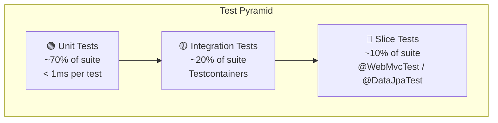

# 🧪 NexusEngine — FAANG-Grade Test Strategy & Implementation Plan

> A comprehensive testing blueprint for building a production-quality test suite that demonstrates mastery of distributed systems testing, enterprise patterns, and engineering rigor.

---

## Table of Contents

1. [Architecture Overview](#1-architecture-overview)
2. [Maven Infrastructure Setup](#2-maven-infrastructure-setup)
3. [Test Directory Structure](#3-test-directory-structure)
4. [Shared Test Infrastructure](#4-shared-test-infrastructure)
5. [Unit Tests](#5-unit-tests)
6. [Integration Tests](#6-integration-tests)
7. [Slice Tests](#7-slice-tests)
8. [Implementing Missing Features (Flash Sale, AI, Coupons)](#8-implementing-missing-features)
9. [Coverage Goals & JaCoCo Configuration](#9-coverage-goals--jacoco-configuration)
10. [Test Naming Conventions & Best Practices](#10-test-naming-conventions--best-practices)
11. [Login Credentials Reference](#11-login-credentials-reference)

---

## 1. Architecture Overview



### Modules Under Test

| Module | Package | Key Classes | Test Focus |
|--------|---------|-------------|------------|
| `nexus-portal` | `com.nexusengine.core.portal` | Order, Cart, Coupon, FlashSale, Payment, Auth, Home, Semantic Search | **Primary test target** |
| `nexus-admin` | `com.nexusengine.core` | Product CRUD, Order Management, RBAC, Dashboard | Admin slice & unit tests |
| `nexus-security` | `com.nexusengine.core.security` | JWT, Dynamic Auth Manager, Rate Limiting | Security-focused unit tests |
| `nexus-data-jpa` | `com.nexusengine.core.model/repository` | 37 entities, 38 repositories | Repository slice tests |
| `nexus-ai` | `com.nexusengine.core.ai` | ChatService, Embeddings | AI service unit tests |
| `nexus-search` | `com.nexusengine.core.search` | Elasticsearch Product Service | ES integration tests |

---

## 2. Maven Infrastructure Setup

### 2.1 Parent POM (`NexusCore/pom.xml`) — Add to `<build><plugins>`

```xml
<!-- Add these dependencies in parent pom <dependencies> section (test scope) -->
<dependency>
    <groupId>org.springframework.boot</groupId>
    <artifactId>spring-boot-starter-test</artifactId>
    <scope>test</scope>
    <!-- Already present — includes JUnit Jupiter, Mockito, AssertJ, JSONassert, JsonPath, Spring Test -->
</dependency>

<!-- Add these NEW test dependencies -->
<dependency>
    <groupId>org.awaitility</groupId>
    <artifactId>awaitility</artifactId>
    <scope>test</scope>
</dependency>

<!-- Testcontainers BOM in <dependencyManagement> -->
<dependency>
    <groupId>org.testcontainers</groupId>
    <artifactId>testcontainers-bom</artifactId>
    <version>1.19.7</version>
    <type>pom</type>
    <scope>import</scope>
</dependency>
```

> [!IMPORTANT]
> `spring-boot-starter-test` already bundles: **JUnit Jupiter 5**, **Mockito 5**, **AssertJ 3**, **JSONassert**, **JsonPath**, **Hamcrest**, and **Spring Test / Spring Boot Test**. Do NOT add them individually.

### 2.2 JaCoCo Plugin — Add to Parent POM `<build><plugins>`

```xml
<plugin>
    <groupId>org.jacoco</groupId>
    <artifactId>jacoco-maven-plugin</artifactId>
    <version>0.8.12</version>
    <executions>
        <!-- Prepare agent before tests run -->
        <execution>
            <id>prepare-agent</id>
            <goals>
                <goal>prepare-agent</goal>
            </goals>
        </execution>
        <!-- Generate report after tests -->
        <execution>
            <id>report</id>
            <phase>verify</phase>
            <goals>
                <goal>report</goal>
            </goals>
        </execution>
        <!-- Enforce coverage thresholds -->
        <execution>
            <id>check</id>
            <goals>
                <goal>check</goal>
            </goals>
            <configuration>
                <rules>
                    <rule>
                        <element>BUNDLE</element>
                        <limits>
                            <limit>
                                <counter>LINE</counter>
                                <value>COVEREDRATIO</value>
                                <minimum>0.70</minimum>
                            </limit>
                            <limit>
                                <counter>BRANCH</counter>
                                <value>COVEREDRATIO</value>
                                <minimum>0.60</minimum>
                            </limit>
                        </limits>
                    </rule>
                </rules>
            </configuration>
        </execution>
    </executions>
    <configuration>
        <excludes>
            <!-- Exclude generated code, configs, DTOs -->
            <exclude>**/config/**</exclude>
            <exclude>**/dto/**</exclude>
            <exclude>**/domain/**</exclude>
            <exclude>**/model/**</exclude>
            <exclude>**/*Application.*</exclude>
        </excludes>
    </configuration>
</plugin>

<!-- Maven Surefire for unit tests -->
<plugin>
    <groupId>org.apache.maven.plugins</groupId>
    <artifactId>maven-surefire-plugin</artifactId>
    <configuration>
        <includes>
            <include>**/*Test.java</include>
        </includes>
        <excludes>
            <exclude>**/*IntegrationTest.java</exclude>
        </excludes>
    </configuration>
</plugin>

<!-- Maven Failsafe for integration tests -->
<plugin>
    <groupId>org.apache.maven.plugins</groupId>
    <artifactId>maven-failsafe-plugin</artifactId>
    <executions>
        <execution>
            <goals>
                <goal>integration-test</goal>
                <goal>verify</goal>
            </goals>
        </execution>
    </executions>
    <configuration>
        <includes>
            <include>**/*IntegrationTest.java</include>
        </includes>
    </configuration>
</plugin>
```

### 2.3 Module-Level Test Dependencies (`nexus-portal/pom.xml`)

The portal module already has Testcontainers PostgreSQL. Add these additional containers:

```xml
<!-- Already present -->
<dependency>
    <groupId>org.testcontainers</groupId>
    <artifactId>junit-jupiter</artifactId>
    <scope>test</scope>
</dependency>
<dependency>
    <groupId>org.testcontainers</groupId>
    <artifactId>postgresql</artifactId>
    <scope>test</scope>
</dependency>

<!-- ADD these for integration tests -->
<dependency>
    <groupId>org.testcontainers</groupId>
    <artifactId>rabbitmq</artifactId>
    <version>1.19.7</version>
    <scope>test</scope>
</dependency>
<dependency>
    <groupId>com.redis</groupId>
    <artifactId>testcontainers-redis</artifactId>
    <version>2.2.2</version>
    <scope>test</scope>
</dependency>
<!-- Or use GenericContainer for Redis — see Section 4 -->

<dependency>
    <groupId>org.awaitility</groupId>
    <artifactId>awaitility</artifactId>
    <scope>test</scope>
</dependency>
```

---

## 3. Test Directory Structure

> [!NOTE]
> The test structure follows the standard Maven convention. The `unit/`, `integration/`, and `slice/` packages provide logical separation within each module.

```
NexusCore/nexus-portal/src/test/java/com/nexusengine/core/portal/
├── unit/                                    # Pure Mockito, zero Spring context
│   ├── service/
│   │   ├── OmsPortalOrderServiceImplTest.java
│   │   ├── OmsCartItemServiceImplTest.java
│   │   ├── UmsMemberServiceImplTest.java
│   │   ├── UmsMemberCouponServiceImplTest.java
│   │   ├── FlashSaleOrderServiceImplTest.java
│   │   ├── HomeServiceImplTest.java
│   │   ├── OmsPromotionServiceImplTest.java
│   │   └── PmsPortalProductServiceImplTest.java
│   ├── strategy/
│   │   ├── FixedAmountStrategyTest.java
│   │   ├── PercentageStrategyTest.java
│   │   ├── FreeShippingStrategyTest.java
│   │   └── CouponStrategyFactoryTest.java
│   ├── component/
│   │   ├── OutboxEventProcessorTest.java
│   │   ├── CancelOrderReceiverTest.java
│   │   └── RateLimitInterceptorTest.java
│   └── security/
│       ├── JwtTokenUtilTest.java
│       └── DynamicAuthorizationManagerTest.java
│
├── integration/                             # Testcontainers (Postgres, Redis, RabbitMQ)
│   ├── config/
│   │   └── TestcontainersConfig.java        # Shared container lifecycle
│   ├── OrderLifecycleIntegrationTest.java
│   ├── OutboxEventIntegrationTest.java
│   ├── CouponConcurrencyIntegrationTest.java
│   └── PaymentWebhookIntegrationTest.java
│
├── slice/                                   # Focused Spring context (@WebMvcTest, @DataJpaTest)
│   ├── controller/
│   │   ├── OmsPortalOrderControllerTest.java
│   │   ├── OmsCartItemControllerTest.java
│   │   ├── UmsMemberControllerTest.java
│   │   ├── UmsMemberCouponControllerTest.java
│   │   └── HomeControllerTest.java
│   └── repository/
│       ├── OmsOrderRepositorySliceTest.java
│       ├── SmsCouponRepositorySliceTest.java
│       └── PmsProductEmbeddingRepositorySliceTest.java

NexusCore/nexus-admin/src/test/java/com/nexusengine/core/
├── unit/
│   ├── UmsAdminServiceImplTest.java
│   ├── PmsProductServiceImplTest.java
│   └── DashboardServiceImplTest.java
├── slice/
│   └── controller/
│       ├── UmsAdminControllerTest.java
│       └── PmsProductControllerTest.java

NexusCore/nexus-security/src/test/java/com/nexusengine/core/security/
├── unit/
│   ├── JwtTokenUtilTest.java
│   ├── JwtSecretValidatorTest.java
│   └── DynamicAuthorizationManagerTest.java

NexusCore/nexus-ai/src/test/java/com/nexusengine/core/ai/
├── unit/
│   └── AbstractNexusChatServiceTest.java
```

---

## 4. Shared Test Infrastructure

### 4.1 Testcontainers Base Configuration

> [!TIP]
> Use `@ServiceConnection` (Spring Boot 3.1+) for automatic datasource wiring — eliminates manual `@DynamicPropertySource`.

Create `nexus-portal/src/test/java/com/nexusengine/core/portal/integration/config/TestcontainersConfig.java`:

```java
package com.nexusengine.core.portal.integration.config;

import org.springframework.boot.test.context.TestConfiguration;
import org.springframework.boot.testcontainers.service.connection.ServiceConnection;
import org.springframework.context.annotation.Bean;
import org.testcontainers.containers.PostgreSQLContainer;
import org.testcontainers.containers.RabbitMQContainer;
import org.testcontainers.containers.GenericContainer;
import org.testcontainers.utility.DockerImageName;

@TestConfiguration(proxyBeanMethods = false)
public class TestcontainersConfig {

    @Bean
    @ServiceConnection
    PostgreSQLContainer<?> postgresContainer() {
        return new PostgreSQLContainer<>(DockerImageName.parse("pgvector/pgvector:pg17"))
                .withDatabaseName("nexuscore_test")
                .withUsername("test")
                .withPassword("test")
                .withReuse(true);  // Reuse across test classes for speed
    }

    @Bean
    @ServiceConnection
    RabbitMQContainer rabbitMQContainer() {
        return new RabbitMQContainer(DockerImageName.parse("rabbitmq:3.13-management"))
                .withReuse(true);
    }

    @Bean
    @ServiceConnection(name = "redis")
    GenericContainer<?> redisContainer() {
        return new GenericContainer<>(DockerImageName.parse("redis:7-alpine"))
                .withExposedPorts(6379)
                .withReuse(true);
    }
}
```

### 4.2 Test application-test.yml

Create `nexus-portal/src/test/resources/application-test.yml`:

```yaml
spring:
  profiles:
    active: test
  jpa:
    hibernate:
      ddl-auto: create-drop   # Fresh schema per test run
    show-sql: true
  flyway:
    enabled: false  # Use JPA auto-DDL in tests instead
  ai:
    openai:
      api-key: test-key  # Mock — never hits real API

jwt:
  secret: test-jwt-secret-key-that-is-at-least-32-characters-long-for-hs512
  expiration: 3600
  tokenHead: 'Bearer '

redis:
  key:
    authCode: 'ums:authCode'
    orderId: 'oms:orderId'
    member: 'ums:member'
    admin: 'ums:admin'
    resourceList: 'ums:resourceList'
  expire:
    authCode: 90
    common: 86400
  database: nexuscore

management:
  tracing:
    enabled: false
```

### 4.3 Test Object Factories (Builder Pattern)

Create `nexus-portal/src/test/java/com/nexusengine/core/portal/TestFixtures.java`:

```java
package com.nexusengine.core.portal;

/**
 * Centralized test data factory using Builder pattern.
 * Provides consistent, valid domain objects for all test layers.
 *
 * WHY: Eliminates test data duplication, ensures referential integrity,
 *      and makes tests self-documenting.
 */
public final class TestFixtures {

    public static UmsMember.Builder member() { /* return pre-filled builder */ }
    public static OmsOrder.Builder order()   { /* return pre-filled builder */ }
    public static OmsCartItem.Builder cartItem() { /* ... */ }
    public static SmsCoupon.Builder coupon()  { /* ... */ }
    public static PmsProduct.Builder product() { /* ... */ }
    public static PmsSkuStock.Builder skuStock() { /* ... */ }
    public static OmsOrderItem.Builder orderItem() { /* ... */ }
    public static OutboxEvent.Builder outboxEvent() { /* ... */ }

    // Convenience: a member with SecurityContext already set
    public static UmsMember authenticatedMember() { /* ... */ }
}
```

> [!IMPORTANT]
> Every test class should use `TestFixtures` for creating domain objects. This ensures a single source of truth for test data and makes refactoring painless.

---

## 5. Unit Tests

> 🟢 **Zero Spring context. Pure Mockito. < 1ms per test. No I/O.**

### 5.1 `OmsPortalOrderServiceImplTest.java`

**Class Under Test**: [`OmsPortalOrderServiceImpl`](file:///home/aadarsh/Documents/NexusEngine/NexusCore/nexus-portal/src/main/java/com/nexusengine/core/portal/service/impl/OmsPortalOrderServiceImpl.java)

**Setup**:
- `@ExtendWith(MockitoExtension.class)`
- Mock all 12+ repository/service dependencies: `OmsOrderRepository`, `OmsOrderItemRepository`, `PmsSkuStockRepository`, `SmsCouponHistoryRepository`, `UmsMemberService`, `OmsCartItemService`, `UmsMemberCouponService`, `OmsOrderSettingRepository`, `OutboxEventRepository`, `OmsPaymentTransactionRepository`, `ObjectMapper`, `PortalOrderDao`
- Use `@InjectMocks` on `OmsPortalOrderServiceImpl`
- Use `ReflectionTestUtils` to inject `@Value` fields

**Test Cases**:

| # | Test Method | What It Validates | Key Assertions |
|---|-------------|-------------------|----------------|
| 1 | `generateOrder_WithValidCart_CreatesOrderAndOutboxEvent` | Happy path: cart → order + outbox event saved atomically | `verify(orderRepository).save(...)`, `verify(outboxEventRepository).save(...)`, order status == 0 (unpaid), `verify(skuStockRepository).save(...)` for stock locking |
| 2 | `generateOrder_EmptyCart_ThrowsApiException` | Empty cart rejection | `assertThrows(ApiException.class, ...)` |
| 3 | `generateOrder_InsufficientStock_ThrowsApiException` | Stock validation | Setup `realStock < quantity`, assert exception with "Insufficient stock" |
| 4 | `generateOrder_WithCoupon_AppliesCouponDiscount` | Coupon integration | Verify `couponAmount > 0` on saved order items, verify `couponHistoryRepository.save(...)` |
| 5 | `cancelOrder_UnpaidOrder_ReleasesStockAndUpdatesCoupon` | Order cancellation flow | Order status → 4 (closed), `skuStock.lockStock` decremented, coupon history use_status → 0 |
| 6 | `cancelOrder_AlreadyPaidOrder_DoesNothing` | Idempotency guard | Order with status=1, verify no state changes |
| 7 | `confirmReceiveOrder_UpdatesStatusAndPoints` | Order completion | Status → 3, member points incremented |
| 8 | `handlePaymentWebhook_ValidPayload_UpdatesOrderToPaid` | Razorpay webhook processing | Status 0→1, `paymentTransactionRepository.save(...)` called |
| 9 | `handlePaymentWebhook_DuplicateTransaction_IsIdempotent` | Duplicate webhook idempotency | When `findByTransactionId` returns existing tx → no order update, no exception |
| 10 | `handlePaymentWebhook_InvalidPayload_ThrowsException` | Malformed webhook rejection | `assertThrows(RuntimeException.class, ...)` |
| 11 | `calculateFreight_TieredPricing_ReturnsCorrectAmount` | Freight calculation logic (private → test via `ReflectionTestUtils.invokeMethod`) | ₹149 for <5k, ₹99 for 5k–20k, ₹49 for 20k–50k, ₹199 for 50k+ |

### 5.2 `FlashSaleOrderServiceImplTest.java`

**Class Under Test**: [`FlashSaleOrderServiceImpl`](file:///home/aadarsh/Documents/NexusEngine/NexusCore/nexus-portal/src/main/java/com/nexusengine/core/portal/service/impl/FlashSaleOrderServiceImpl.java)

**Setup**: Mock `StringRedisTemplate`, `AmqpTemplate`, `UmsMemberService`

| # | Test Method | What It Validates |
|---|-------------|-------------------|
| 1 | `generateFlashOrder_Success_SendsMessageToQueue` | Lua script returns 1 → MQ message sent with correct routing key |
| 2 | `generateFlashOrder_OutOfStock_ReturnsFailure` | Lua script returns 0 → "sold out" message |
| 3 | `generateFlashOrder_AlreadyPurchased_ReturnsFailure` | Lua script returns -1 → "already purchased" |
| 4 | `generateFlashOrder_RateLimited_ReturnsFailure` | Redis rate limit script returns > 1 → "too frequent" |
| 5 | `generateFlashOrder_UnauthenticatedUser_ReturnsUnauthorized` | `getCurrentMember()` returns null → 401 |

### 5.3 `UmsMemberServiceImplTest.java` *(Enhance Existing)*

**Existing tests are good.** Add these FAANG-level scenarios:

| # | Test Method | What It Validates |
|---|-------------|-------------------|
| 1 | `register_DuplicateUsername_ThrowsApiException` | Constraint violation for existing username/email |
| 2 | `register_NullAuthCode_ThrowsApiException` | Missing auth code handling |
| 3 | `login_AccountLocked_ThrowsBadCredentials` | Status check before password match |
| 4 | `getCurrentMember_NoSecurityContext_ThrowsApiException` | SecurityContextHolder.getContext() with no auth |

### 5.4 Coupon Strategy Tests (Strategy Pattern — Pure Unit)

These are **the easiest wins** — no Spring, no mocks needed for the strategies themselves.

#### `FixedAmountStrategyTest.java`
```
- calculateDiscount_ReturnsFixedAmount_RegardlessOfItems
- calculateDiscount_NullAmount_HandlesGracefully
```

#### `PercentageStrategyTest.java`
```
- calculateDiscount_10PercentOnTwoItems_ReturnsCorrectDiscount
- calculateDiscount_WithMaxCap_RespectsMaxDiscountAmount
- calculateDiscount_WithZeroMaxCap_IgnoresCap
- calculateDiscount_EmptyItemList_ReturnsZero
```

#### `FreeShippingStrategyTest.java`
```
- calculateDiscount_AlwaysReturnsZero (freight handled at order level)
```

#### `CouponStrategyFactoryTest.java`
```
- getStrategy_Type0_ReturnsFixedAmount
- getStrategy_Type1_ReturnsPercentage
- getStrategy_Type2_ReturnsFreeShipping
- getStrategy_NullType_DefaultsToFixedAmount
- getStrategy_UnknownType_ThrowsIllegalArgument
```

### 5.5 `OutboxEventProcessorTest.java`

**Class Under Test**: [`OutboxEventProcessor`](file:///home/aadarsh/Documents/NexusEngine/NexusCore/nexus-portal/src/main/java/com/nexusengine/core/portal/component/OutboxEventProcessor.java)

| # | Test Method | What It Validates |
|---|-------------|-------------------|
| 1 | `processOutboxEvents_PendingEvents_SendsToRabbitAndMarksSent` | Happy path: PENDING → SENT |
| 2 | `processOutboxEvents_AmqpException_IncrementsRetryCount` | Retry logic: retryCount++ on AMQP failure |
| 3 | `processOutboxEvents_ExceedsMaxRetries_MarksAsFailed` | After 3 retries → status FAILED |
| 4 | `processOutboxEvents_InvalidPayload_MarksAsFailed` | NumberFormatException in payload → FAILED |
| 5 | `processOutboxEvents_LockNotAcquired_SkipsProcessing` | Distributed lock contention → no events processed |

### 5.6 `DynamicAuthorizationManagerTest.java`

**Class Under Test**: [`DynamicAuthorizationManager`](file:///home/aadarsh/Documents/NexusEngine/NexusCore/nexus-security/src/main/java/com/nexusengine/core/security/component/DynamicAuthorizationManager.java)

| # | Test Method | What It Validates |
|---|-------------|-------------------|
| 1 | `check_IgnoredUrl_Grants` | `/swagger-ui.html` → `AuthorizationDecision(true)` |
| 2 | `check_OptionsRequest_Grants` | CORS preflight → allowed |
| 3 | `check_PortalPath_AuthenticatedUser_Grants` | `/portal/**` with valid auth → allowed |
| 4 | `check_PortalPath_AnonymousUser_Denies` | `/portal/**` anonymous → denied |
| 5 | `check_AdminPath_UnmappedResource_FailClosed` | Admin path not in `ums_resource` → **DENIED** (fail-closed) |
| 6 | `check_AdminPath_CorrectRole_Grants` | Admin path mapped to Role 1, user has Role 1 → allowed |
| 7 | `check_AdminPath_WrongRole_Denies` | Admin path mapped to Role 1, user has Role 2 → denied |

### 5.7 `JwtTokenUtilTest.java`

| # | Test Method | What It Validates |
|---|-------------|-------------------|
| 1 | `generateToken_ReturnsValidJwt` | Token is non-null, non-empty, parseable |
| 2 | `getUsernameFromToken_ReturnsCorrectUsername` | Roundtrip: generate → extract |
| 3 | `validateToken_ValidToken_ReturnsTrue` | Token matches UserDetails |
| 4 | `validateToken_ExpiredToken_ReturnsFalse` | Expired JWT rejected |
| 5 | `validateToken_TamperedToken_ReturnsFalse` | Modified payload fails verification |
| 6 | `canTokenBeRefreshed_NotExpired_ReturnsTrue` | Refresh window check |

### 5.8 `CancelOrderReceiverTest.java`

| # | Test Method | What It Validates |
|---|-------------|-------------------|
| 1 | `handle_ValidOrderId_CancelsOrder` | Delegates to `portalOrderService.cancelOrder(orderId)` |
| 2 | `handle_ServiceThrows_WrapsInAmqpRejectException` | Exception wrapping for DLQ routing |

### 5.9 `RateLimitInterceptorTest.java`

| # | Test Method | What It Validates |
|---|-------------|-------------------|
| 1 | `preHandle_ProductListPath_IPRateLimited_Returns429` | 101st request to `/portal/product/list` → 429 with `Retry-After` header |
| 2 | `preHandle_PaymentPath_UserRateLimited_Returns429` | 11th Razorpay request from same user → blocked |
| 3 | `preHandle_NormalPath_NoRateLimit_Proceeds` | Non-rate-limited path → `true` |
| 4 | `preHandle_PaymentPath_UnauthenticatedUser_Proceeds` | No user resolved → skip rate limiting, allow through |

---

## 6. Integration Tests

> 🟡 **Full Spring context + Testcontainers (PostgreSQL, Redis, RabbitMQ). Tests real component interactions.**

> [!IMPORTANT]
> All integration tests must use `@Import(TestcontainersConfig.class)` and `@ActiveProfiles("test")`. Name them `*IntegrationTest.java` so Maven Failsafe picks them up.

### 6.1 `OrderLifecycleIntegrationTest.java`

**What it tests**: Complete order lifecycle from cart → checkout → payment → cancellation

**Containers**: PostgreSQL (pgvector/pgvector:pg17), Redis, RabbitMQ

**Annotations**:
```java
@SpringBootTest(webEnvironment = SpringBootTest.WebEnvironment.RANDOM_PORT)
@Import(TestcontainersConfig.class)
@ActiveProfiles("test")
@Testcontainers
```

| # | Test Method | Scenario |
|---|-------------|----------|
| 1 | `fullOrderLifecycle_CartToPayment` | 1. Add product to cart → 2. Generate order → 3. Verify stock locked → 4. Simulate payment webhook → 5. Verify order status = 1 (paid) → 6. Verify `OmsPaymentTransaction` created |
| 2 | `unpaidOrderExpiry_CancelledViaDLQ` | 1. Create order → 2. Use `Awaitility.await().atMost(30, SECONDS)` for TTL queue → DLQ → cancel → 3. Verify stock released |
| 3 | `orderWithCoupon_DiscountAppliedAndHistoryUpdated` | 1. Claim coupon → 2. Create order with couponId → 3. Verify `couponAmount` on order items → 4. Verify `SmsCouponHistory.useStatus = 1` |

### 6.2 `OutboxEventIntegrationTest.java`

**What it tests**: Outbox pattern reliability — DB + RabbitMQ transactional consistency

| # | Test Method | Scenario |
|---|-------------|----------|
| 1 | `outboxEvent_PendingToSent_PublishesToRabbitMQ` | Insert PENDING event → trigger processor → verify message arrives on RabbitMQ queue → event status = SENT |
| 2 | `outboxEvent_RabbitMQDown_RetriesAndEventuallyFails` | Stop RabbitMQ container → trigger processor → verify retryCount increments → after 3 retries, status = FAILED |

**Key Library**: Use **Awaitility** for async assertions:
```java
await().atMost(10, SECONDS)
       .untilAsserted(() -> {
           OutboxEvent event = outboxEventRepository.findById(eventId).orElseThrow();
           assertThat(event.getStatus()).isEqualTo("SENT");
       });
```

### 6.3 `CouponConcurrencyIntegrationTest.java`

**What it tests**: Race condition handling on coupon claiming with Redisson distributed locks

| # | Test Method | Scenario |
|---|-------------|----------|
| 1 | `concurrentCouponClaim_OnlyOneSucceeds` | 10 threads claim the same coupon (perLimit=1) simultaneously → exactly 1 succeeds, 9 fail |
| 2 | `concurrentStockDeduction_NeverGoesNegative` | Coupon with count=5 → 20 concurrent claims → exactly 5 succeed, coupon.count = 0 |

**Implementation Pattern**:
```java
ExecutorService executor = Executors.newFixedThreadPool(10);
CountDownLatch latch = new CountDownLatch(1);
AtomicInteger successCount = new AtomicInteger(0);

for (int i = 0; i < 10; i++) {
    executor.submit(() -> {
        latch.await();  // All threads start simultaneously
        try {
            couponService.add(couponId);
            successCount.incrementAndGet();
        } catch (Exception ignored) {}
    });
}
latch.countDown();
executor.awaitTermination(10, SECONDS);

assertThat(successCount.get()).isEqualTo(1);
```

### 6.4 `PaymentWebhookIntegrationTest.java`

**What it tests**: Razorpay webhook idempotency and order state transitions

| # | Test Method | Scenario |
|---|-------------|----------|
| 1 | `validWebhook_CreatesTransactionAndUpdatesOrder` | Post valid JSON → order status 0→1, transaction saved |
| 2 | `duplicateWebhook_IsIdempotent` | Same transactionId twice → second call is no-op, no exception |
| 3 | `webhookForAlreadyPaidOrder_NoDoubleProcessing` | Order already status=1 → no status change |

---

## 7. Slice Tests

> 🔵 **Focused `ApplicationContext` — only loads the slice being tested. Much faster than full `@SpringBootTest`.**

### 7.1 `@WebMvcTest` — Controller Slice Tests

#### `OmsPortalOrderControllerTest.java`

```java
@WebMvcTest(OmsPortalOrderController.class)
@Import({SecurityConfig.class, CommonSecurityConfig.class}) // Load security filter chain
@ActiveProfiles("test")
```

**Mock beans**: `OmsPortalOrderService`, `UmsMemberService` (via `@MockBean`)

| # | Test Method | HTTP | Assertions |
|---|-------------|------|------------|
| 1 | `generateConfirmOrder_Authenticated_Returns200` | `POST /portal/order/generateConfirmOrder` with JWT | `status().isOk()`, JSON body contains `calcAmount` |
| 2 | `generateOrder_ValidPayload_Returns200` | `POST /portal/order/generateOrder` with `OrderParam` | `jsonPath("$.data.orderSn").exists()` |
| 3 | `generateOrder_Unauthenticated_Returns401` | `POST /portal/order/generateOrder` without JWT | `status().isUnauthorized()` |
| 4 | `cancelOrder_ValidOrderId_Returns200` | `POST /portal/order/cancelOrder` | `status().isOk()` |
| 5 | `paymentWebhook_ValidPayload_Returns200` | `POST /portal/order/webhook/razorpay` | `status().isOk()` |
| 6 | `listOrders_Paginated_ReturnsJsonArray` | `GET /portal/order/list?status=1&pageNum=1&pageSize=5` | `jsonPath("$.data").isArray()` |

**MockMvc Setup Example**:
```java
@Autowired
private MockMvc mockMvc;

@Test
void generateOrder_Unauthenticated_Returns401() throws Exception {
    mockMvc.perform(post("/portal/order/generateOrder")
                    .contentType(MediaType.APPLICATION_JSON)
                    .content("{\"memberReceiveAddressId\":1}"))
            .andExpect(status().isUnauthorized());
}

@Test
@WithMockUser(username = "testuser")
void generateConfirmOrder_Authenticated_Returns200() throws Exception {
    ConfirmOrderResult mockResult = new ConfirmOrderResult();
    when(orderService.generateConfirmOrder(anyList())).thenReturn(mockResult);

    mockMvc.perform(post("/portal/order/generateConfirmOrder")
                    .contentType(MediaType.APPLICATION_JSON)
                    .content("[1,2,3]"))
            .andExpect(status().isOk())
            .andExpect(jsonPath("$.code").value(200));
}
```

#### `UmsMemberControllerTest.java`

| # | Test Method | HTTP | Assertions |
|---|-------------|------|------------|
| 1 | `login_ValidCredentials_ReturnsTokenPair` | `POST /portal/sso/login` | `jsonPath("$.data.token").exists()`, `jsonPath("$.data.tokenHead").value("Bearer ")` |
| 2 | `login_InvalidCredentials_ReturnsValidationFailed` | `POST /portal/sso/login` | `jsonPath("$.code").value(404)` |
| 3 | `register_ValidInput_Returns200` | `POST /portal/sso/register` | `status().isOk()` |
| 4 | `getInfo_Authenticated_ReturnsMemberDetails` | `GET /portal/sso/info` with JWT | `jsonPath("$.data.username").value("testuser")` |

#### `HomeControllerTest.java`

| # | Test Method | HTTP | Assertions |
|---|-------------|------|------------|
| 1 | `content_ReturnsHomepageContent` | `GET /portal/home/content` | `jsonPath("$.data.advertiseList").isArray()`, `jsonPath("$.data.newProductList").isArray()` |
| 2 | `productCateList_ReturnsCategories` | `GET /portal/home/productCateList/0` | `jsonPath("$.data").isArray()` |

### 7.2 `@DataJpaTest` — Repository Slice Tests

> [!TIP]
> `@DataJpaTest` auto-configures an embedded datasource, scans for `@Entity` classes, and configures Spring Data JPA repositories. For PostgreSQL-specific features (pgvector, jsonb), use Testcontainers instead of H2.

#### `OmsOrderRepositorySliceTest.java`

```java
@DataJpaTest
@Testcontainers
@AutoConfigureTestDatabase(replace = AutoConfigureTestDatabase.Replace.NONE)
@Import(TestcontainersConfig.class)  // Uses pgvector PostgreSQL
@ActiveProfiles("test")
```

| # | Test Method | What It Validates |
|---|-------------|-------------------|
| 1 | `save_NewOrder_PersistsAllFields` | All columns persisted correctly including jsonb `webhookPayload` |
| 2 | `findByMemberIdAndStatus_ReturnsCorrectOrders` | Query method filter by member + status |
| 3 | `findByOrderSn_ReturnsUniqueOrder` | Order serial number lookup |

#### `SmsCouponRepositorySliceTest.java`

| # | Test Method | What It Validates |
|---|-------------|-------------------|
| 1 | `save_CouponWithMaxDiscountAmount_Persists` | New V6 column `max_discount_amount` |
| 2 | `countByCouponIdAndMemberId_AccurateCount` | Coupon history counting |

#### `PmsProductEmbeddingRepositorySliceTest.java`

| # | Test Method | What It Validates |
|---|-------------|-------------------|
| 1 | `save_VectorEmbedding_PersistsWithPgVector` | `vector` column type works with pgvector |
| 2 | `findNearestProducts_ReturnsClosestVectors` | Native vector similarity query `<=>` operator |

> [!WARNING]
> This test **requires** the `pgvector/pgvector:pg17` Docker image. Standard PostgreSQL won't work because the `vector` type is a pgvector extension.

---

## 8. Implementing Missing Features

> [!CAUTION]
> This section outlines the **database schema changes and design required** to complete Flash Sale, AI Chatbot, and Coupon features. **Do NOT implement code changes yet** — this is a reference for future implementation.

### 8.1 Flash Sale — Missing Tables & Gaps

**Current State**: `FlashSaleOrderServiceImpl` uses Redis Lua scripts for atomic stock deduction and RabbitMQ for async processing, but there are **no flash promotion database tables** for managing flash sale events, sessions, and product-session mappings.

#### New Tables Required

```sql
-- V7__flash_sale_tables.sql

-- Flash promotion event (e.g., "Diwali Mega Sale")
CREATE TABLE sms_flash_promotion (
    id              BIGSERIAL PRIMARY KEY,
    title           VARCHAR(200)    NOT NULL,
    start_date      DATE            NOT NULL,
    end_date        DATE            NOT NULL,
    status          INTEGER         DEFAULT 0,  -- 0=inactive, 1=active
    create_time     TIMESTAMP       DEFAULT NOW()
);
COMMENT ON TABLE sms_flash_promotion IS 'Flash promotion event definition';

-- Flash promotion time session (e.g., "10:00 AM - 12:00 PM")
CREATE TABLE sms_flash_promotion_session (
    id              BIGSERIAL PRIMARY KEY,
    name            VARCHAR(200)    NOT NULL,
    start_time      TIME            NOT NULL,   -- e.g., '10:00:00'
    end_time        TIME            NOT NULL,   -- e.g., '12:00:00'
    status          INTEGER         DEFAULT 0,  -- 0=inactive, 1=active
    create_time     TIMESTAMP       DEFAULT NOW()
);
COMMENT ON TABLE sms_flash_promotion_session IS 'Time slots within a flash promotion day';

-- Product ↔ Session mapping with flash-specific price and stock
CREATE TABLE sms_flash_promotion_product_relation (
    id                              BIGSERIAL PRIMARY KEY,
    flash_promotion_id              BIGINT          NOT NULL REFERENCES sms_flash_promotion(id),
    flash_promotion_session_id      BIGINT          NOT NULL REFERENCES sms_flash_promotion_session(id),
    product_id                      BIGINT          NOT NULL,
    flash_promotion_price           DECIMAL(10,2)   NOT NULL,
    flash_promotion_count           INTEGER         NOT NULL,   -- Total flash stock
    flash_promotion_limit           INTEGER         DEFAULT 1,  -- Per-user limit
    sort                            INTEGER         DEFAULT 0,
    UNIQUE(flash_promotion_id, flash_promotion_session_id, product_id)
);
COMMENT ON TABLE sms_flash_promotion_product_relation IS 'Products in a specific flash session with flash pricing';
CREATE INDEX idx_fpp_session ON sms_flash_promotion_product_relation(flash_promotion_id, flash_promotion_session_id);

-- Flash sale order log for auditing
CREATE TABLE sms_flash_promotion_log (
    id              BIGSERIAL PRIMARY KEY,
    member_id       BIGINT      NOT NULL,
    product_id      BIGINT      NOT NULL,
    flash_promotion_id BIGINT,
    session_id      BIGINT,
    order_id        BIGINT,
    quantity        INTEGER     DEFAULT 1,
    status          VARCHAR(50) DEFAULT 'PENDING',  -- PENDING, SUCCESS, FAILED
    create_time     TIMESTAMP   DEFAULT NOW()
);
CREATE INDEX idx_flash_log_member ON sms_flash_promotion_log(member_id, product_id);
```

#### What Needs to Happen in Code

1. **JPA Entities**: Create `SmsFlashPromotion`, `SmsFlashPromotionSession`, `SmsFlashPromotionProductRelation`, `SmsFlashPromotionLog`
2. **Repositories**: Create JPA repositories for each entity
3. **Admin Service**: CRUD APIs for managing flash sales (create event → create sessions → assign products with flash prices)
4. **Portal Service**: `HomeServiceImpl.content()` currently returns `new HomeFlashPromotion()` — wire it to query the active session
5. **FlashSaleOrderReceiver**: The existing `FlashSaleOrderReceiver` consumer should: (a) validate DB stock, (b) create `OmsOrder` + `OmsOrderItem`, (c) log to `sms_flash_promotion_log`
6. **Redis Warm-Up**: On flash sale start, pre-load `flash:stock:{promotionId}:{sessionId}:{productId}` from DB into Redis

### 8.2 AI / Chatbot — Gaps & Suggestions

**Current State**: `AbstractNexusChatService` provides a solid base with session memory via Spring AI's `MessageWindowChatMemory`. `PortalChatServiceImpl` and `AdminChatServiceImpl` exist. However:

#### Missing Pieces

| Gap | Suggestion |
|-----|-----------|
| No conversation persistence | Add a `chat_conversation` table to store chat history per member for analytics |
| No RAG (Retrieval Augmented Generation) | Use product embeddings from `pms_product_embedding` as context to ground chatbot answers in actual product data |
| No admin analytics | Track chat volume, popular queries, fallback rates |
| Session memory is in-memory only | For production, replace `InMemoryChatMemoryRepository` with a Redis-backed or PostgreSQL-backed `ChatMemoryRepository` |

#### Suggested Table

```sql
-- V8__ai_chat_history.sql

CREATE TABLE ai_chat_conversation (
    id              BIGSERIAL PRIMARY KEY,
    member_id       BIGINT,
    session_id      VARCHAR(100)    NOT NULL,
    role            VARCHAR(20)     NOT NULL,   -- 'user' or 'assistant'
    content         TEXT            NOT NULL,
    model           VARCHAR(50)     DEFAULT 'gpt-4o-mini',
    tokens_used     INTEGER,
    create_time     TIMESTAMP       DEFAULT NOW()
);
CREATE INDEX idx_chat_session ON ai_chat_conversation(session_id);
CREATE INDEX idx_chat_member ON ai_chat_conversation(member_id);
COMMENT ON TABLE ai_chat_conversation IS 'Persisted AI chat history for analytics and context';
```

#### Code Changes Needed

1. Create `AiChatConversation` entity and repository
2. Implement a `JpaChatMemoryRepository` implementing Spring AI's `ChatMemoryRepository` interface
3. Add a `/portal/chat/history` endpoint for members to view past conversations
4. In `PortalChatServiceImpl`, inject product context from `PmsProductSemanticSearchService` as RAG context before the LLM call

### 8.3 Coupons — Gaps & Suggestions

**Current State**: Solid coupon system with Strategy Pattern (Fixed, Percentage, FreeShipping), Redisson distributed locks for claiming, and V6 migration adding `max_discount_amount` and brand relations.

#### Missing Pieces

| Gap | Suggestion |
|-----|-----------|
| No coupon code redemption (public share codes) | Add a public `code` field to `sms_coupon`, a `/portal/member/coupon/redeem` endpoint |
| No coupon stacking rules | Add `stackable` boolean to `sms_coupon` — prevent stacking by default |
| No auto-expiry notifications | Scheduled job to notify members of soon-to-expire coupons |
| Optimistic locking not wired | V6 added `version` column but `SmsCoupon` entity doesn't use `@Version` |
| Brand-based coupons not implemented in strategy | `use_type=3` (brand) relation table exists but `UmsMemberCouponServiceImpl` doesn't handle it |

#### Suggested Table Alterations

```sql
-- V9__coupon_improvements.sql

-- Wire optimistic locking (already has version column from V6)
-- Just need to add @Version in SmsCoupon entity

-- Add stackable flag
ALTER TABLE sms_coupon ADD COLUMN IF NOT EXISTS stackable BOOLEAN DEFAULT FALSE;
COMMENT ON COLUMN sms_coupon.stackable IS 'Whether this coupon can be combined with other coupons';

-- Add public code for shareable coupons
ALTER TABLE sms_coupon ADD COLUMN IF NOT EXISTS is_public BOOLEAN DEFAULT FALSE;
COMMENT ON COLUMN sms_coupon.is_public IS 'Whether coupon can be claimed by entering a code';

-- Index for code lookups
CREATE INDEX IF NOT EXISTS idx_coupon_code ON sms_coupon(code) WHERE code IS NOT NULL;
```

#### Code Changes Needed

1. Add `@Version private Integer version;` to `SmsCoupon` entity for optimistic locking
2. Add `stackable` and `isPublic` fields to `SmsCoupon`
3. Implement `BrandCouponStrategy` (use_type=3) that filters eligible items by brand
4. Add `redeemByCode(String code)` method to `UmsMemberCouponService`
5. Handle `OptimisticLockException` gracefully in `UmsMemberCouponServiceImpl.add()`

---

## 9. Coverage Goals & JaCoCo Configuration

### Target Coverage

| Module | Line Coverage | Branch Coverage | Rationale |
|--------|:---:|:---:|-----------|
| `nexus-portal` (services) | **≥ 80%** | **≥ 70%** | Core business logic — highest priority |
| `nexus-portal` (components) | **≥ 75%** | **≥ 65%** | Outbox, DLQ, rate limiting |
| `nexus-portal` (strategies) | **≥ 95%** | **≥ 90%** | Pure logic, easy to test |
| `nexus-security` | **≥ 80%** | **≥ 70%** | Security-critical paths |
| `nexus-admin` (services) | **≥ 70%** | **≥ 60%** | CRUD-heavy, less complex logic |
| `nexus-ai` | **≥ 60%** | **≥ 50%** | External API dependency |

### Running Commands

```bash
# Run unit tests only (fast — < 30s)
cd NexusCore && ./mvnw test

# Run integration tests only (requires Docker — ~2-5 min)
cd NexusCore && ./mvnw verify -DskipTests

# Run all tests with coverage report
cd NexusCore && ./mvnw clean verify

# View JaCoCo report
open NexusCore/nexus-portal/target/site/jacoco/index.html
```

### JaCoCo Report in HTML

After running `mvn verify`, JaCoCo generates per-module reports at:
```
NexusCore/nexus-portal/target/site/jacoco/index.html
NexusCore/nexus-admin/target/site/jacoco/index.html
NexusCore/nexus-security/target/site/jacoco/index.html
```

---

## 10. Test Naming Conventions & Best Practices

### Naming: `methodUnderTest_StateUnderTest_ExpectedBehavior`

```java
// ✅ Good
void cancelOrder_UnpaidOrder_ReleasesStockAndUpdatesCoupon()
void generateFlashOrder_OutOfStock_ReturnsFailure()
void check_AdminPath_UnmappedResource_FailClosed()

// ❌ Bad
void testCancelOrder()
void test1()
```

### FAANG-Impressing Patterns Used

| Pattern | Where Used | Why It Impresses |
|---------|-----------|------------------|
| **Strategy Pattern Testing** | `CouponStrategyFactoryTest` | Shows understanding of OOP design patterns |
| **Outbox Pattern Testing** | `OutboxEventProcessorTest` + Integration | Distributed systems reliability |
| **Idempotency Testing** | `PaymentWebhookIntegrationTest` | Critical for financial systems |
| **Concurrency Testing** | `CouponConcurrencyIntegrationTest` | Race condition awareness |
| **Fail-Closed Security** | `DynamicAuthorizationManagerTest` | Security-first mindset |
| **Circuit Breaker Fallback** | `PmsProductSemanticSearchServiceImplTest` | Resilience4j integration |
| **Dead-Letter Queue** | `OrderLifecycleIntegrationTest` | RabbitMQ expertise |
| **Awaitility Async** | Integration tests | Non-flaky async testing |
| **Testcontainers** | All integration tests | Production-parity testing |
| **`@ServiceConnection`** | `TestcontainersConfig` | Spring Boot 3.x best practices |

### AssertJ Over JUnit Assertions

```java
// ✅ Use AssertJ (fluent, descriptive failure messages)
assertThat(order.getStatus()).isEqualTo(1);
assertThat(result).hasSize(5).extracting("name").contains("iPhone 15");
assertThatThrownBy(() -> service.cancelOrder(999L))
    .isInstanceOf(ApiException.class)
    .hasMessageContaining("not found");

// ❌ Avoid raw JUnit assertions
assertEquals(1, order.getStatus());
```

---

## 11. Login Credentials Reference

From [`README.md`](file:///home/aadarsh/Documents/NexusEngine/README.md):

| Service | URL | Username | Password |
|---------|-----|----------|----------|
| Customer Portal | `http://localhost:5174` | *(user registration)* | — |
| Admin Panel | `http://localhost:5173` | *(via `/admin/login`)* | — |
| Backend API | `http://localhost:8080` | — | — |
| Swagger UI | `http://localhost:8080/swagger-ui.html` | — | — |
| Search API Swagger | `http://localhost:8081/swagger-ui.html` | — | — |
| Grafana | `http://localhost:3000` | `admin` | `admin` |
| MinIO Console | `http://localhost:9001` | `minioadmin` | `minioadmin` |

### Test Payment Cards (Razorpay)

| Card Type | Number | Expiry | CVV |
|-----------|--------|--------|-----|
| Visa (Domestic) | `4100 2800 0000 1007` | Any future date | Any 3 digits |
| RuPay (Domestic) | `6527 6589 0000 1005` | Any future date | Any 3 digits |
| Mastercard (Domestic) | `5555 5555 0008 1006` | Any future date | Any 3 digits |

*(3D Secure OTP: Any 6-digit number or click "Success")*

### Test JWT for Tests

```yaml
# Use in application-test.yml
jwt:
  secret: test-jwt-secret-key-that-is-at-least-32-characters-long-for-hs512
  expiration: 3600
  tokenHead: 'Bearer '
```

---

## Summary Checklist

- [ ] Add JaCoCo + Surefire + Failsafe plugins to parent POM
- [ ] Add Awaitility, Testcontainers (RabbitMQ, Redis) dependencies
- [ ] Create `application-test.yml`
- [ ] Create `TestcontainersConfig.java`
- [ ] Create `TestFixtures.java` test data factory
- [ ] Implement **11** Unit test classes (~50+ test methods)
- [ ] Implement **4** Integration test classes (~10+ test methods)
- [ ] Implement **8** Slice test classes (~25+ test methods)
- [ ] Create Flash Sale DB tables (V7 migration)
- [ ] Create AI Chat History table (V8 migration)
- [ ] Alter coupon tables (V9 migration)
- [ ] Achieve ≥ 70% line coverage across all modules
- [ ] Run `mvn clean verify` — all green ✅
